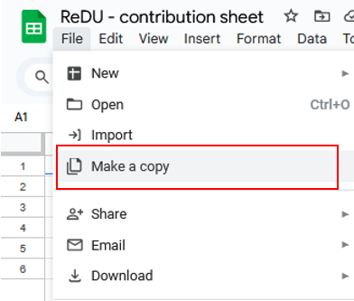
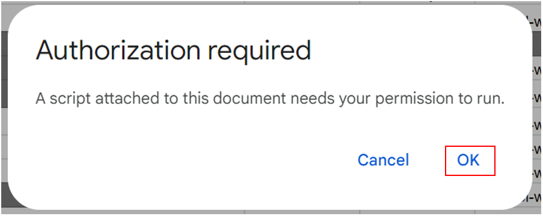
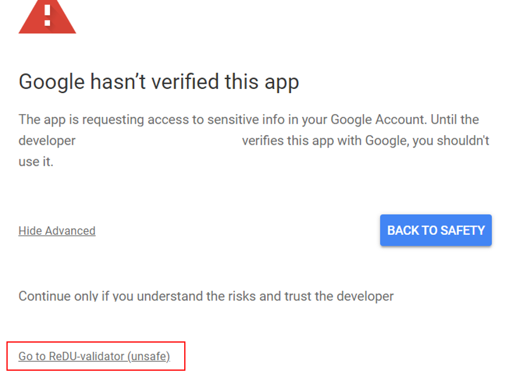

# Pan-ReDU metadata validation and submission

This tutorial explains how to submit metadata for your MassIVE dataset. This assumes that you have already submitted your mass spectral raw data at [MassIVE](https://massive.ucsd.edu/) (the tutorial for this step can be found [here](https://ccms-ucsd.github.io/MassIVEDocumentation/#account_registration/)). If you submitted your raw data to [MetaboLights](https://www.ebi.ac.uk/metabolights/index) or [Metabolomics Workbench](https://www.metabolomicsworkbench.org), we will automatically pull your raw data from there. In case you want to include a ReDU sheet for a dataset from there, please reach out to us.

## Steps to submit your metadata

1. **Create a metadata sheet**
    - You are allowed to use any of the columns displayed in our [Term description sheet](https://docs.google.com/spreadsheets/d/10U0xnJUKa_mD0H_9suH1KJAlJD9io9e4chBX8EAHneE/edit?gid=1856413163#gid=1856413163). The filename and MassiveID columns are required. From the other columns, you can select those relevant to your study. We hope that you provide as much information as possible!
    - In ReDU, we use a controlled vocabulary, which means that you can only use certain terms in the table. These terms are controlled either by us or externally, as specified in the [Term description sheet](https://docs.google.com/spreadsheets/d/10U0xnJUKa_mD0H_9suH1KJAlJD9io9e4chBX8EAHneE/edit?gid=1856413163#gid=1856413163). The list of allowed terms controlled by us is displayed in the [Allowed terms sheet](https://docs.google.com/spreadsheets/d/10U0xnJUKa_mD0H_9suH1KJAlJD9io9e4chBX8EAHneE/edit?gid=155945972#gid=155945972). If you need more terms or columns, please reach out to yelabiead(at)ucsd.edu.

2. **Validate your metadata sheet**
    - After you have created your sheet, you should validate it to ensure everything is correct. To do this, you will need to make a copy of our [Google Sheet](https://docs.google.com/spreadsheets/d/10U0xnJUKa_mD0H_9suH1KJAlJD9io9e4chBX8EAHneE/edit?usp=sharing).

    

    - Copy your metadata into an empty sheet and click ReDU-menu --> Current Sheet Validation. This will validate your ReDU sheet and color cells depending on whether the values are accepted by Pan-ReDU or not. The first time you do this, you will encounter several warnings to click through, as you need to trust our Sheet to use it. Below, we have provided screenshots to show what to click. You will only need to do this the first time you make a copy of our sheet.  

    

    How to click through warnings (only the first time the script is run):

    

    

    

    

    - After the script runs, you will see a popup indicating how many of your samples have been accepted or rejected. If a cell is colored red, it means that the respective row will not be accepted in ReDU. This occurs if your filenames don’t have the expected extension (.mzML or .mzXML) or if your MassiveID is not valid. Cells colored in grey will be replaced with "missing values" in ReDU. If a cell is colored grey even though you think it should be accepted, check for spelling and capitalization errors or trailing white spaces (" ") in your values. You can rerun the validation as often as needed.

    - Once you are satisfied, you can download your table as a .tsv file.

    - This TSV file can now be submitted to ReDU through our [deposition portal](https://deposit.redu.gnps2.org/).

    

# Page Contributions
Yasin El Abiead (UCSD) and Mingxun Wang (UCR)
