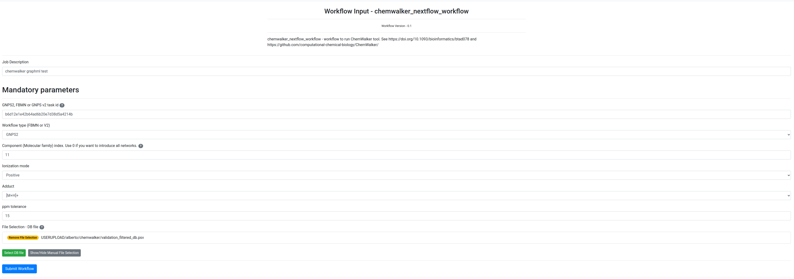
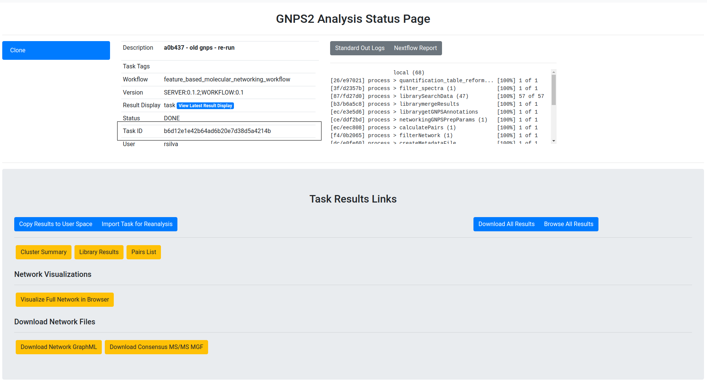
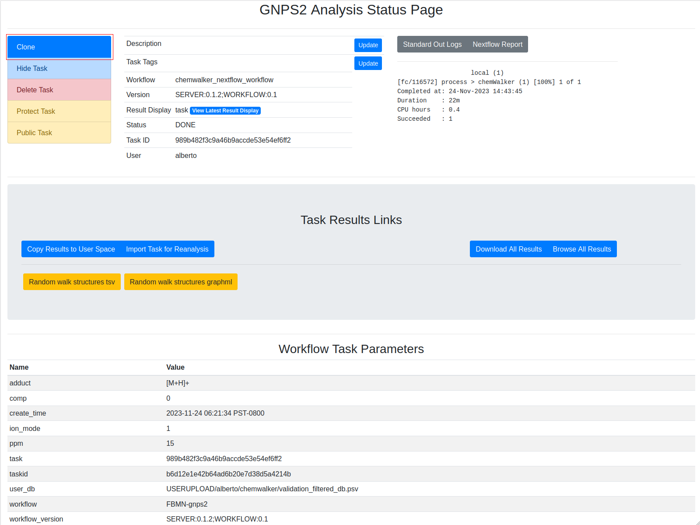
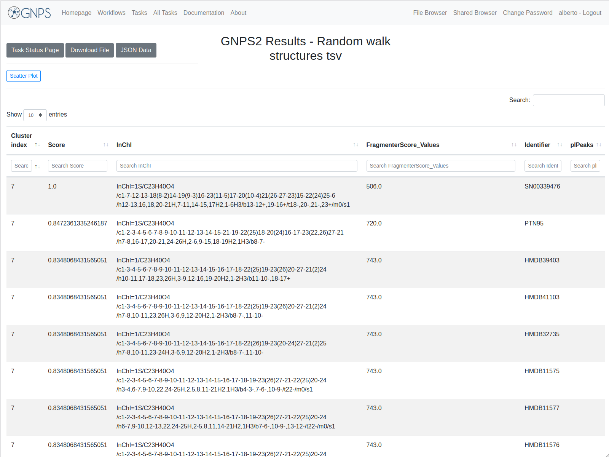

## ChemWalker workflow documentation

Chemwalker is a tool published by R. da Silva lab to annotate features in metabolomic networks by propagating annotations on non-directly connected nodes by using MetFrag. The article is published [here](https://academic.oup.com/bioinformatics/article/39/3/btad078/7067745) and the source code is available in [github](https://github.com/computational-chemical-biology). 

### Input

The fields are presented in the image:
. Bold fields are mandatory

1. task description
Optional, a description of the task to ease the user its identification. 

2. **GNPS2, FBMN, or FBMNv2 task id**

The information from the molecular network is necessary to annotate the nodes (features). For that, chemwalker needs the job id of the molecular network task. To view the task_id, check the image and the red rectangle: 
. 
The task id can correspond to a GNPS2 Feature based molecular networking (FBMN) [https://gnps2.org/workflowinput?workflowname=feature_based_molecular_networking_workflow](https://gnps2.org/workflowinput?workflowname=feature_based_molecular_networking_workflow), to a GNPS FBMN[https://gnps.ucsd.edu/ProteoSAFe/index.jsp?params=%7B%22workflow%22:%22FEATURE-BASED-MOLECULAR-NETWORKING%22,%22library_on_server%22:%22d.speclibs;%22%7D](https://gnps.ucsd.edu/ProteoSAFe/index.jsp?params=%7B%22workflow%22:%22FEATURE-BASED-MOLECULAR-NETWORKING%22,%22library_on_server%22:%22d.speclibs;%22%7D) or a GNPS Molecular Networking v2 [https://gnps.ucsd.edu/ProteoSAFe/index.jsp?params=%7B%22workflow%22:%22METABOLOMICS-SNETS-V2%22,%22library_on_server%22:%22d.speclibs;%22%7D](https://gnps.ucsd.edu/ProteoSAFe/index.jsp?params=%7B%22workflow%22:%22METABOLOMICS-SNETS-V2%22,%22library_on_server%22:%22d.speclibs;%22%7D). 

3. **Workflow type (GNPS2, FBMN or V2)**
The task id of the molecular netowrking. Be aware that tasks from FBMN or molecular networking v2 depend on the GNPS availability and the GNPS2 depends on the GNPS2 availability. If the GNPS server is down, the chemwalker task will not work for those tasks since it needs to retrieve the data from GNPS. Analogously the GNPS2 depends on GNPS2 availability. 

4. **Component (Molecular family) index** 

The component index of the network to annotate. If the user wants to annotate all networks, a 0 shall be introduced. 
The molecular networking has been performed before. If the user only wants to annotate a specific network and its nodes. If a 0 is introduced, all networks will be annotated. If a component index with no nodes is introduced, the task will fail. 

5. **File selection** 

The database where the annotations will be based. This database will be used later to use the MetFrag software against and annotate and score the molecules. 

To create a user specific database, see [https://ccms-ucsd.github.io/GNPSDocumentation/nap/#structure-database](https://ccms-ucsd.github.io/GNPSDocumentation/nap/#structure-database). By default, the COCONUT database will be used and the user does not need to upload it. 

### Output

The different parts of the output are presented in the image:

1. **Log Text area**
Text area with the result of the task. If there is some fail, the log will be written there. If the task failed and you want to contact the support team, please provide the output of this text area along with the job id. 

2. **Full results from the job**
Full results from the job. It can provide information to debug or to users with programming knowledge. 

3. **random walk structures.tsv**
File with the annotations over the nodes in the selected network/s. You can download to see the full fields or visit the online version. For a full analysis the download of the file is recommended.

4. **random walk structures.graphml**

Graphml with the annotations to visualize the nodes in Cytoscape. You can import this datafile and dynamically analyze it there.

### Example task

To test the functionality of the ChemWalker workflow an [Example task](httpshttps://gnps2.org/status?task=13e0cc3fafd14f328197c0b45999abc8) can be visited, and this work can be reproduced by clicking the clone button: 

#### Input

1. task description: empty

2. **GNPS2, FBMN, or FBMNv2 task id**: b6d12e1e42b64ad6b20e7d38d5a4214b

3. **Workflow type (GNPS2, FBMN or V2)**: GNPS2

4. **Component (Molecular family) index**: 11

5. **File selection**: COCONUT.tsv

#### Output

The result of the task is the annotation of compounds from the chosen database according to the in-silico fragmentations calculated by MetFrag. The cluster index is the identification of the feature, the score is the associated score for the corresponding annotation for that specific feature. Results are sorted according to cluster index and score. The online results are not complete, it is recommended to download the full table. 

 

The user can download the graphml with the new nodes annotated by chem Walker, and now each node in the network contains the annotation calculated by ChemWalker. 

 