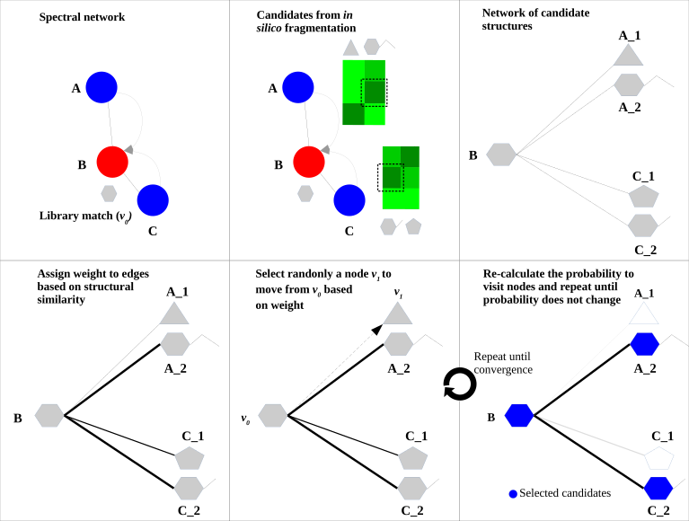

# ChemWalker workflow documentation

Chemwalker is a tool published by R. da Silva lab to annotate features in metabolomic networks by propagating annotations on non-directly connected nodes by using MetFrag. The article is published [here](https://academic.oup.com/bioinformatics/article/39/3/btad078/7067745) and the source code is available in [github](https://github.com/computational-chemical-biology). 
A detailed explanation of the tool is found [below](#full-tutorial-of-chemwalker). 

## Quick tutorial of chemwalker workflow

### Input

| Parameter  | Description        |  Default | Required | 
| ------------- |-------------| -----| -----|
| Job Description | Label for the ChemWalker job to identify it by the user | | no |
| GNPS task ID | GNPS molecular networking task id. [Identify the task id of your FBMN job in GNPS2](./img/workflows/task_id.png). See [the links to the jobs in GNPS and GNPS2](#links-to-task-ids) | | yes |
| Workflow type | FBMN or Classic (V2) from GNPS and FBMN from GNPS2, named GNPS2. If the GNPS server is down, the chemwalker task will not work for FBMN or Classic (V2) since it needs to retrieve the data from GNPS. Analogously with GNPS2. Links  | GNPS2 | yes |
| Component Index  | Index of a connected component of interest in a Molecular Network. The propagation is limited to the connected component. Zero will perform propagation inside all components. | | yes |
| Ionization mode | Mass spectrometry acquisition mode. | Positive | yes |
| Adduct ion type | Expected adduct type for the precursor ion mass. It should be consistent with the ionization mode, otherwise the workflow will fail. | [M+H]+ | yes |
| PPM tolerance (ppm) | Accuracy used for structure database search. The predicted neutral mass (for a given adduct selected) is compared to the exact mass of the structures provided. | 15 | yes |
| Structure databases | The default natural products database is the [COCONUT](https://coconut.naturalproducts.net/) database or in house candidate structure database. See the [Structure Database section](#structure-database) | COCONUT.psv | yes |

The fields are presented in the image. Bold fields are mandatory:

### Links to task ids

The information from the molecular network is necessary to annotate the nodes (features). For that, chemwalker needs the job id of the molecular network task. To view the task_id, check the red rectangle in the [image](./img/workflows/task_id.png). The task id can correspond to a [GNPS2 Feature based molecular networking (FBMN)](https://gnps2.org/workflowinput?workflowname=feature_based_molecular_networking_workflow), to a [GNPS FBMN](https://gnps.ucsd.edu/ProteoSAFe/index.jsp?params=%7B%22workflow%22:%22FEATURE-BASED-MOLECULAR-NETWORKING%22,%22library_on_server%22:%22d.speclibs;%22%7D) or a [GNPS Molecular Networking v2](https://gnps.ucsd.edu/ProteoSAFe/index.jsp?params=%7B%22workflow%22:%22METABOLOMICS-SNETS-V2%22,%22library_on_server%22:%22d.speclibs;%22%7D). 

### Example Input

| #   | Information                                        | Value                                      |
| --- | ------------------------------------------------- | ------------------------------------------- |
| 1.  | Task description                                  | User label to identify the workflow task    |
| 2.  | **GNPS2, FBMN, or FBMNv2 task id**                | b6d12e1e42b64ad6b20e7d38d5a4214b            |
| 3.  | **Workflow type (GNPS2, FBMN or V2)**             | GNPS2                                       |
| 4.  | **Component (Molecular family) index**            | 11                                          |
| 5.  | **File selection**                                | COCONUT.tsv                                 |

### Output

| #   | Item                              | Description                                                                                                                      |
| --- | ----------------------------------| ---------------------------------------------------------------------------------------------------------------------------------|
| 1.  | **Log Text area**                 | Text area with the result of the task. If there is some fail, the log will be written there. If the task failed and you want to contact the support team, please provide the output of this text area along with the job id. |
| 2.  | **Full results from the job**     | Full results from the job. It can provide information to debug or to users with programming knowledge.                          |
| 3.  | **random walk structures.tsv**    | File with the annotations over the nodes in the selected network/s. You can download to see the full fields or visit the online version. For a full analysis, the download of the file is recommended. |
| 4.  | **random walk structures.graphml**| Graphml with the annotations to visualize the nodes in Cytoscape. You can import this data file and dynamically analyze it there.      |

The different parts of the output are presented in the image:

## Example task

To test the functionality of the ChemWalker workflow an [Example task](httpshttps://gnps2.org/status?task=13e0cc3fafd14f328197c0b45999abc8) can be visited, and this work can be reproduced by clicking the [clone button](./img/workflows/clone_button.png): 

### Example output

The result of the task is the annotation of compounds from the chosen database according to the in-silico fragmentations calculated by MetFrag. The cluster index is the identification of the feature, the score is the associated score for the corresponding annotation for that specific feature. Results are sorted according to cluster index and score. The online results are not complete, it is recommended to download the full table. 

 

The user can download the graphml with the new nodes annotated by chem Walker, and now each node in the network contains the annotation calculated by ChemWalker. 

 

# Full tutorial of ChemWalker 

ChemWalker is a python package to propagate spectral library match identities through candidate structures provided by in silico fragmentation, using random walk.
 

Check out the package's [documentation](https://github.com/computational-chemical-biology/ChemWalker).

### Structure database 

There are basically three options for database structure selection:

1. The default natural products database is the [COCONUT](https://coconut.naturalproducts.net/) database. 
2. Input an in house generated database. 
A standard format is required for the in house database. One can easily collect structures in the literature and format a tab separated files with SMILES strings and a character identifier of any kind, as the example database [Right-click, and Save link as](https://raw.githubusercontent.com/DorresteinLaboratory/GNPSDocumentation/master/docs/static/JNP_Kyobin.txt):  

Having an in house collection, the user has to first format the database, using the following [webserver](http://seriema.fcfrp.usp.br:5002/upload):

After submission for conversion the user should receive an email with the link to download a file in the following format [Right-click, and Save link as](https://raw.githubusercontent.com/DorresteinLaboratory/GNPSDocumentation/master/docs/static/JNP_Kyobin_formatted.txt):

## ChemWalker Visualization in Cytoscape

In a similar way as Molecular Networking uses Cytoscape to visualize the whole network, we can visualize structure prediction of entire connected component or networks using the output `Random walk strtuctures graphml` available at the results page.

Cytoscape (we have used version >= 3.4) is available for download from [here](http://www.cytoscape.org). 

### Download ChemWalker's Cytoscape files

To download the Cytoscape file, go back to the results page of your task:

After the download, remember to uncompress the file for downstream use.

### Installing the ChemViz plugin

To visualize the structures on NAP output we need the [ChemViz](https://apps.cytoscape.org/apps/chemviz) plugin. The easiest way to install it is using Cytoscape's App Manager, as shown below:

## Load ChemWalker's Cytoscape file and apply layout

Load the graphml file and apply a layout to spread the nodes:

## Change image display properties and paint library match structure 

The graphml file contains some pre-set elements to aid structure display. Browsing the 'Table Panel' is possible to inspect which scoring method has structures available in the column SMILES. To use one of these columns to display the structures we have first to change the properties of ChemViz, by doing:

After setting the desired source column to display the structure one can just 'paint' the structure on the node:

### Display the list of candidates

The most correct structure may not be the first candidate. Therefore we can display the structures outputted from our [initial parameters](#parameter-walkthrough):

## Citation

[Tiago Cabral Borelli, Gabriel Santos Arini, Luís G P Feitosa, Pieter C Dorrestein, Norberto Peporine Lopes, Ricardo R da Silva. Improving annotation propagation on molecular networks through random walks: introducing ChemWalker. Bioinformatics 2023, 39(3), btad078.](https://doi.org/10.1093/bioinformatics/btad078)

## Page Contributors

{{ git_page_authors }}

