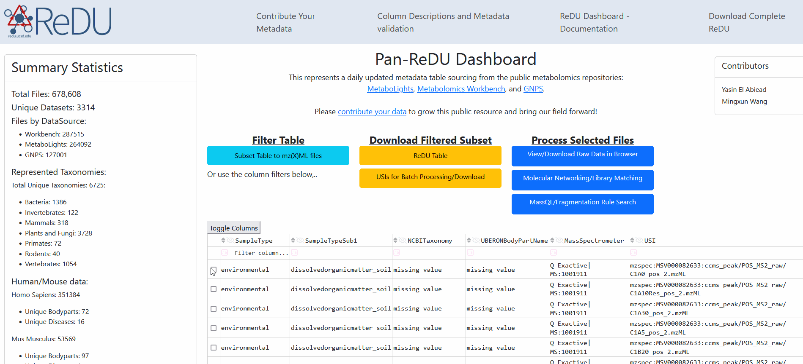

# Downloading public metabolomics data

This tutorial explains how to download public mass spectral raw data from [MetaboLights](https://www.ebi.ac.uk/metabolights/index), [Metabolomics Workbench](https://www.metabolomicsworkbench.org), or [MassIVE/GNPS](https://massive.ucsd.edu/) through GNPS tooling.

There are three main ways to download data.

## Download raw data file-by-file in the [GNPS2 Dashboard](https://explorer.gnps2.org/)/[Pan-ReDU Metadata Dashboard](https://redu.gnps2.org/selection/)



## Download raw data file-by-file in the [GNPS2 Dataset Explorer](https://explorer.gnps2.org/)


## Download raw data in batch through our public data downloader

This can be done through our [public data downloader](https://github.com/Wang-Bioinformatics-Lab/downloadpublicdata), which requires just a few command line steps.

This downloadpublicdata tool enables you to download several different types of data in different ways using MRI reference to each public file. Specifically, you are able to download:

1. MRIs of open formats, e.g. mzML, mzXML, MGF
1. MRIs of vendor raw data, e.g. .raw, .d, etc. while maintaining the full folder structure for formats like .d
1. MRIs of vendor raw data automatically converted to the mzML open format


### Using Downloader Steps

1. Make sure you have [Python](https://wiki.python.org/moin/BeginnersGuide/Download) and [Git](https://github.com/git-guides/install-git) installed on your system.

1. Clone the [repository](https://github.com/Wang-Bioinformatics-Lab/downloadpublicdata) through your terminal by running:

   ```bash
   git clone https://github.com/Wang-Bioinformatics-Lab/downloadpublicdata.git
   ```

1. Navigate to the directory in your terminal with:

   ```bash
   cd downloadpublicdata
   ```

1. Install required packages with:

   ```bash
   pip install -r requirements.txt
   ```

1. Test if it works with:

   ```bash
   python ./bin/download_public_data_usi.py ./data/test_download.tsv ./data/ ./data/summary.tsv
   ```

1. Replace `./data/test_download.tsv` with the path to a TSV file containing the USIs you want to download. An example file can be found [here](https://github.com/Wang-Bioinformatics-Lab/downloadpublicdata/blob/main/data/test_download.tsv). This should download the raw data into the folder `./data/`.

   > **Note**: By default, files are converted to `.mzML` format before the download. If you wish to download without conversion, you can use the `--noconversion` flag:

   ```bash
   python ./bin/download_public_data_usi.py ./data/test_download.tsv ./data/ ./data/summary.tsv --noconversion
   ```

Further details can be found in the [GitHub README](https://github.com/Wang-Bioinformatics-Lab/downloadpublicdata).


