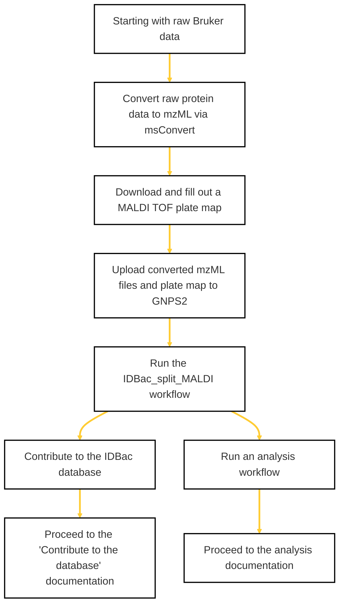

### If you are starting with raw Bruker data, use this flow chart to prepare your files for analysis or deposition. 
*Click on a step for links to the required tools/pages.*

    

### More Resources

  
Navigating MSConvert

Use the following images to convert raw Bruker data to mzML using MSConvert

    
  <ul>

 </ul>

  
Uploading files to the GNPS2 File Browser

  <ul>

 </ul>

  
Accessing your converted files from the split_MALDI workflow
 

Download the converted and re-named files to your desktop (allowing for manual upload into a File Browser folder)

  <ul> 

 </ul>

 

