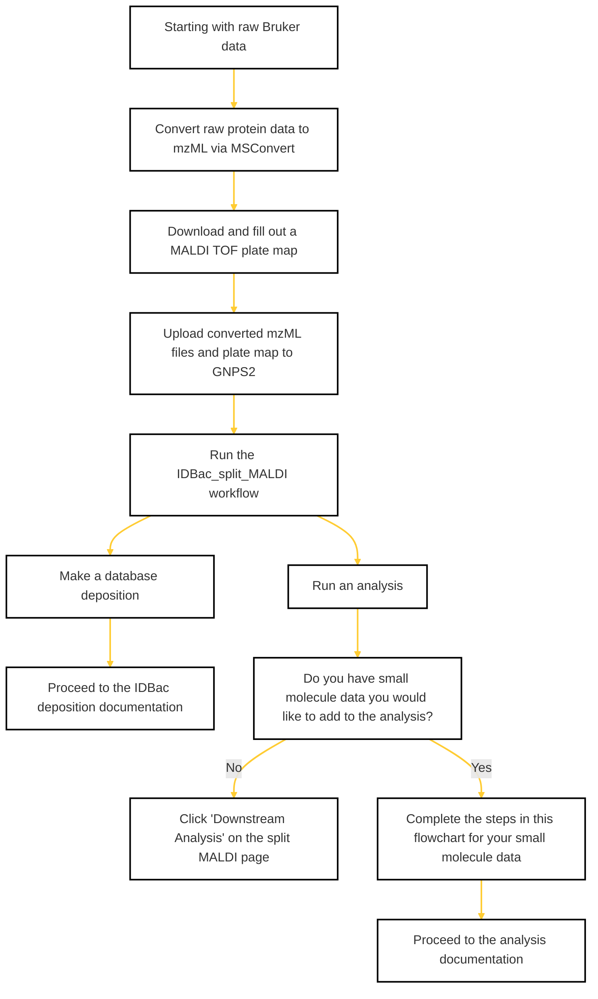

### 🚧 Work In Progress
This page is under construction, thanks for your patience!

### If you are starting with raw Bruker data, use this flow chart to prepare your files for analysis or deposition. 
#### Click on each step for links to the required tools/pages.

    

### More Resources

  
Navigating MSConvert

  
  Use the following images to convert raw Bruker data to mzML

