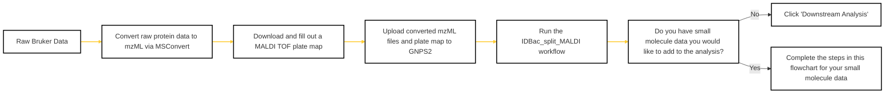

NOTE: This page is currently being updated, please visit at a later time or email nkrull@uic.edu with any questions

```mermaid
flowchart LR
    A[Raw Bruker Data] --> B[Convert raw protein data to mzML via MSConvert]
    B --> C[Download and fill out a MALDI TOF plate map]
    C --> D[Upload converted mzML files and plate map to GNPS2]
    D --> E[Run the IDBac_split_MALDI workflow]
    E --> F[Do you have small molecule data you would like to add to the analysis?]
    F --> |No| G[Click 'Downstream Analysis']
    F --> |Yes| H[Complete the steps in this flowchart for your small molecule data]
    click B href "https://proteowizard.sourceforge.io/"
    click C href "https://docs.google.com/spreadsheets/d/1ihFy6lQyJtWy9fp46ahMPWk7xLp2tJ3q/edit?usp=sharing&ouid=102573514213912402103&rtpof=true&sd=true"
    click D href "https://gnps2.org/homepage"
    click E href "https://gnps2.org/workflowinput?workflowname=idbac_split_maldi_workflow"

 %% Styling
    style A fill:#FFFFFF,stroke:#000000,stroke-width:2px
    style B fill:#FFFFFF,stroke:#000000,stroke-width:2px
    style C fill:#FFFFFF,stroke:#000000,stroke-width:2px
    style D fill:#FFFFFF,stroke:#000000,stroke-width:2px
    style E fill:#FFFFFF,stroke:#000000,stroke-width:2px
    style F fill:#FFFFFF,stroke:#000000,stroke-width:2px
    style G fill:#FFFFFF,stroke:#000000,stroke-width:2px
    style H fill:#FFFFFF,stroke:#000000,stroke-width:2px
    
    %% Link Styling
    linkStyle 0 stroke:#ffcc33,stroke-width:2px
    linkStyle 1 stroke:#ffcc33,stroke-width:2px
    linkStyle 2 stroke:#ffcc33,stroke-width:2px
    linkStyle 3 stroke:#ffcc33,stroke-width:2px
    linkStyle 4 stroke:#ffcc33,stroke-width:2px
```