### 🚧 Work In Progress
This page is under construction, thanks for your patience!

### Analyze your data

This flow chart is a guide on how to submit an analysis workflow.  

**Click on the flow chart boxes for links to the required tools/pages*  
**Protein data analysis can be conducted without a metadata sheet.*  
**Small molecule data analysis requires a metadata sheet.*

```mermaid
flowchart TD
    A[Submit your data for analysis] --> B[Download and fill out an analysis metadata sheet]
    B --> C[Upload your metadata and mzML files to the GNPS2 File Browser]
    C --> D[Open the idbac_analysis_workflow]
    D --> E[Select appropriate data for each file selection section]
    E --> F[Select preferred distance metric]
    F --> G[Select preferred database distance threshold]
    G --> H[Submit workflow]
    H --> I[Choose a data analysis option]
    I --> J[Web IDBac Analysis Platform]
    J --> K[Database Search Summary- see tab below]
   
    click B href "https://docs.google.com/spreadsheets/d/1Y7WHrFQR_SYpR_p5u_xL4BQimYorQ3-1PfAfVil3nL0/edit?gid=678327011#gid=678327011"
    click D href "https://gnps2.org/workflowinput?workflowname=idbac_analysis_workflow"
    click J href "https://wang-bioinformatics-lab.github.io/GNPS2_Documentation/idbacanalysisplatform/"
    


 %% Styling
    style A fill:#FFFFFF,stroke:#000000,stroke-width:2px,font-size:24px
    style B fill:#FFFFFF,stroke:#000000,stroke-width:2px,font-size:18px
    style C fill:#FFFFFF,stroke:#000000,stroke-width:2px,font-size:18px
    style D fill:#FFFFFF,stroke:#000000,stroke-width:2px,font-size:18px
    style E fill:#FFFFFF,stroke:#000000,stroke-width:2px,font-size:18px
    style F fill:#FFFFFF,stroke:#000000,stroke-width:2px,font-size:18px
    style G fill:#FFFFFF,stroke:#000000,stroke-width:2px,font-size:18px
    style H fill:#FFFFFF,stroke:#000000,stroke-width:2px,font-size:18px
    style I fill:#FFFFFF,stroke:#000000,stroke-width:2px,font-size:18px
    style J fill:#FFFFFF,stroke:#000000,stroke-width:2px,font-size:18px
    

%% Link Styling
    linkStyle 0 stroke:#ffcc33,stroke-width:3px
    linkStyle 1 stroke:#ffcc33,stroke-width:3px
    linkStyle 2 stroke:#ffcc33,stroke-width:3px
    linkStyle 3 stroke:#ffcc33,stroke-width:3px
    linkStyle 4 stroke:#ffcc33,stroke-width:3px
    linkStyle 5 stroke:#ffcc33,stroke-width:3px
    linkStyle 6 stroke:#ffcc33,stroke-width:3px
    linkStyle 7 stroke:#ffcc33,stroke-width:3px
    linkStyle 8 stroke:#ffcc33,stroke-width:3px
  
    
   

```

    

### More Resources

  
QC your Data

Use the following images to convert raw Bruker data to mzML:

  <ul>

 </ul>

  
Metadata Instructions

This page can also be found in the Metadata Excel doc.

  <ul>

 </ul>

  
Navigating the idbac_analysis_workflow page

Use the following images to convert raw Bruker data to mzML:

  <ul>

 </ul>

