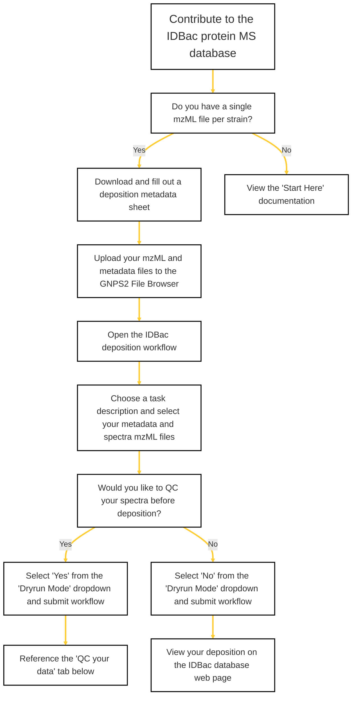

### IDBac Database Depositions
This flow chart is a guide on how to deposit genetically verified strains in the IDBac protein MS database. 

**Click on a step for links to the required tools/pages.*

**IDBac workflows require a mzML file format. For guidance on how to convert raw data or mzXML to mzML, see the 'Start Here' tabs to the left.*

**All database depositions must have either an accompanying accession number or 16S taxonomy assignment and sequence.*

    

### More Resources

  
QC your Data

Use the following images to convert raw Bruker data to mzML:

  <ul>

 </ul>

  
Metadata Instructions

This page can also be found in the Metadata Excel doc.:

  <ul>

 </ul>

