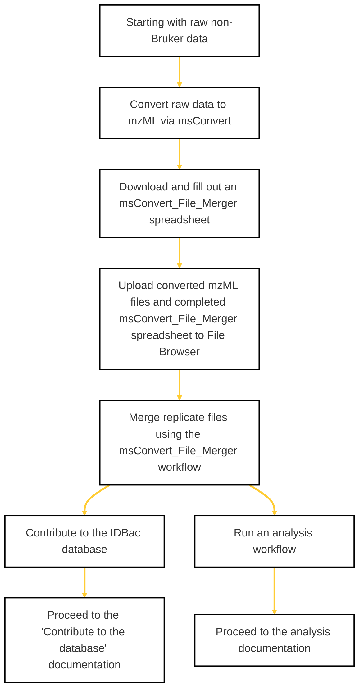

### 🚧 Work In Progress
This page is under construction, thanks for your patience!

### If you are starting with raw non-Bruker data, use this flow chart to prepare your files for analysis or deposition. 
*Click on a step for links to the required tools/pages.*

    

### More Resources

  
Instructions for filling out the msConvert_File_Merger spreadsheet

i) Insert the current filenames for your individual mzML files into the 'input_filename' column. It is important to keep the '.mzml' tag on the end of the filename in this column. Take care to make sure the filenames in the spreadsheet under 'input_filename' match the filenames in your data folder.

ii) Type a new filename for replicate spectra you would like to combine into a single mzml file. You do NOT need to include the '.mzml' tag in this column. Make sure the 'output_filename' is identical for all replicate spectra you want to be merged. Otherwise the workflow will write files with different 'output_filename' entries as separate mzML files. 
    
  <ul>

 </ul>

  
Uploading files to the GNPS2 File Browser

    
  <ul> 

 </ul>

  
Navigating the msConvert_File_Merger workflow

    

This workflow will combine spectra from separate spots that correspond to the same bacterial strain (i.e. replicate spots). The output is a single mzML file (per strain) that contains the replicate spectra as separate scans.

i) Open the msConvert_File_Merger workflow.

ii) Select your mzML files and your input/output spreadsheet from the dropdown menus.

iii) Select mzML or mzXML as your output data format.

iV) Submit workflow.

    
  <ul> 

 </ul>

