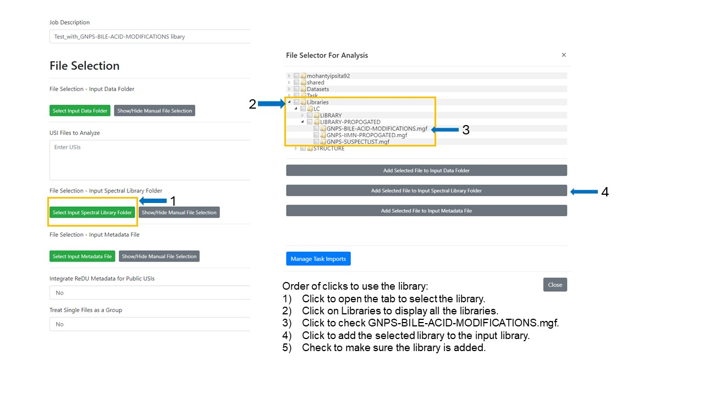

## GNPS Spectral Libraries

MS/MS spectral libraries from GNPS, Massbank, MONA, and other sources are available for spectral matching in GNPS2.

## Propogated MS/MS Spectral Libraries

This section contains propagated spectral libraries that inherently are less confident but this provides an avenue to give more identifications.

### Candidate bile acid isomer spectral library

The bile acid MS/MS spectral library consists of 21,549 spectra representing modifications to the bile acid steroid core. The GNPS-BILE-ACID-MODIFICATIONS library will not be added as a default library and will need to be added as an additional libraries for spectral matching while analyzing data as a molecular network.

1. Click on the "Select Input Spectral Library Folder" to open the new tab where you can select the bile acid modification library. 
2. Click on "Library" to dispaly all the propagated libraries.
3. From this list, click on GNPS-BILE-ACID-MODIFICATIONS library to select it. 
4. Click on the "Add Selected File to Input Spectral Library Folder" to add the library for spectral matching.
3. Verify that the library now appears in the "File Selection - Input Spectral Library Folder" in the main workkflow launch page.
4. You can then fill other parameters for the GNPS2 job and submit your analyses. 

