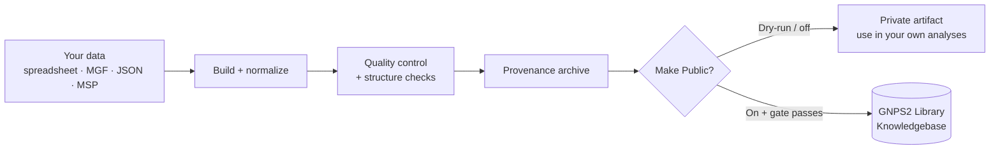
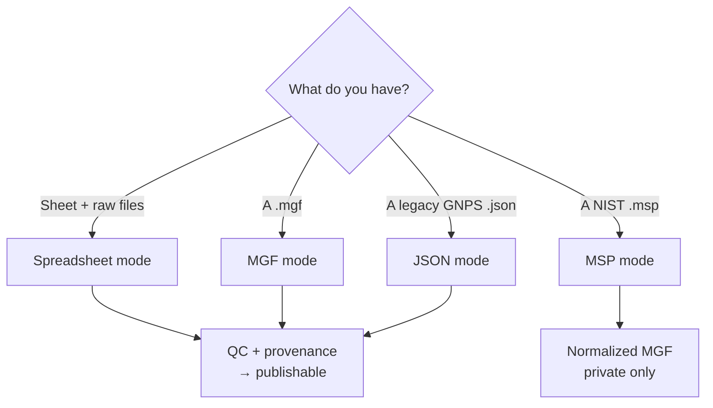
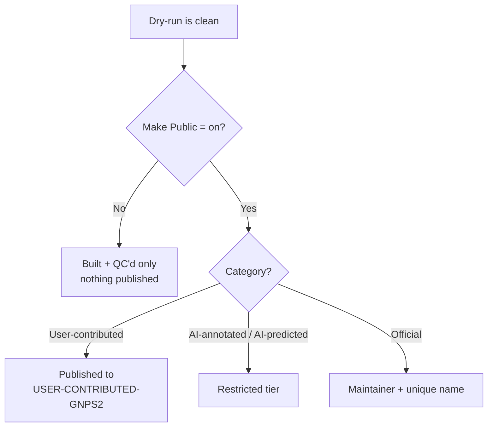

# Depositing to the GNPS2 Library Knowledgebase

The **GNPS2 Library Knowledgebase** is the searchable home for GNPS2 spectral
reference libraries. This guide is about getting **your** library into it: how to
build a deposit from what you already have, quality-control it, test it safely
with a dry-run, and publish it — either to the open community tier yourself, or
to the official tier through the GNPS2 team.

A short [For library consumers](#for-library-consumers) section at the end covers
searching the Knowledgebase once libraries are in it.

---

## The deposition pipeline at a glance

Everything you deposit flows through the **Library Creation Workflow**. It
normalizes your spectra into the GNPS2 format, runs quality control, and writes a
provenance archive recording exactly what went in and what came out. Only after
that — and only if you ask for it — does it publish.

---

## Step 1 — Choose your input mode

The workflow accepts four kinds of input. Pick the one that matches what you
already have; the form's **Input Mode** selector switches between them.

| You have… | Input mode | What it's for | QC | Publishable |
|---|---|---|---|---|
| An annotation spreadsheet **+** raw files (`.mzML` / `.mzXML`) | **Spreadsheet** | Building a public-quality library from scratch | Yes | Yes |
| A GNPS-style `.mgf` | **MGF** | Depositing an existing MGF library | Yes | Yes |
| An authoritative legacy-GNPS library `.json` | **JSON** | Porting a GNPS-1 library onto GNPS2 | Yes | Yes |
| A NIST-style `.msp` | **MSP** | Building a **private** search resource | No | No |

The first three modes run the **same** QC + provenance pipeline, so a spreadsheet
build, an MGF deposit, and a legacy republish all get identical structure
validation, a per-row QC report, and a provenance archive.

**MSP is the exception.** It simply re-emits a NIST import as a GNPS2-normalized
MGF for your own private spectral search — no QC, no provenance, and it never
publishes. Use it when you want a private search library, not a contribution.

### Preparing a spreadsheet deposit

Spreadsheet mode is the from-scratch path and needs the most preparation, so it
gets the most help:

- Your annotation sheet follows the **GNPS classic library-submission schema** —
  column names like `FILENAME`, `EXTRACTSCAN`, `IONSOURCE`, `INCHIAUX` (the
  InChIKey), `LIBQUALITY`, `EXACTMASS`, `ADDUCT`, and so on.
- Start from the **five-row template** in `data/annotation_example.tsv`, which
  shows both polarities, common adducts, and how to use the `FROMDATA` sentinel.
- `FROMDATA` (or a blank cell) tells the workflow to **read that value from the
  raw file** instead of trusting the sheet — handy for instrument, ion source,
  collision energy, and MS level. Precursor m/z is always taken from the raw
  scan.
- Each row points at one MS/MS scan: `FILENAME` names the raw file in your data
  folder, and `EXTRACTSCAN` selects the scan within it.
---

## Step 2 — Understand what QC will check

Before you publish anything, the workflow validates every row. Rows fall into
three outcomes:

- **Kept** — passed cleanly.
- **Soft-warn** — kept, but flagged in the report so you can review it.
- **Hard-fail** — dropped from the library.

The hard-fail checks are the ones to design your data around:

| Check | A row is dropped when… |
|---|---|
| MS level | The spectrum isn't MS² |
| Polarity match | The declared polarity contradicts the scan |
| Precursor m/z consistency | The precursor mass doesn't match the adduct + structure (report shows `delta=` in Daltons) |
| Peaks present | The spectrum has no fragment peaks |
| Structure consistency | The `SMILES` / `INCHI` / `INCHIAUX` / `SELFIES` you gave don't all describe the same molecule |

The **structure check** is worth calling out: the workflow canonicalizes every
structural identifier you provide to an InChIKey and confirms they agree. If you
supply some but not all identifiers, the missing ones are imputed for you from
what you gave. If they disagree — or you gave only an InChIKey (a one-way hash it
can't verify) — the row hard-fails. Give at least one parseable structure
(SMILES, InChI, or SELFIES) per row.

---

## Step 3 — Always dry-run first

Every deposition run has a **dry-run** switch. Use it before you publish
anything. A dry-run does the *entire* build — normalization, QC, structure
checks — and produces the QC report and the resulting library, **without** ever
writing to the Knowledgebase.

1. Leave **Make Public** *off* (this keeps the run a dry-run).
2. Run the workflow with your inputs.
3. Open the **QC report** view and read down the rows:
   - Fix **hard-fail** rows at the source (wrong polarity, precursor mismatch,
     missing peaks, inconsistent structures).
   - Review **soft-warn** rows — each warning tells you what looked off.
4. Re-run until the report is clean.

Only once a dry-run looks right should you turn on publishing.

!!! note "Publishing forces a real run"
    Turning on **Make Public** automatically makes the run a real (non-dry) run,
    so a published library always carries its full provenance archive. You cannot
    "publish a dry-run" — dry-run and publish are mutually exclusive by design.

---

## Step 4 — Publish

When a dry-run is clean, choose where it goes. There are three publishing
categories, and they gate very differently.

| Category | Goes to | Who can publish |
|---|---|---|
| **User-contributed** | Shared `USER-CONTRIBUTED-GNPS2` library | **Any authenticated GNPS2 user** — no approval needed |
| **AI-annotated / AI-predicted** | Pooled `AI-*-GNPS2` libraries | Restricted (service / maintainer accounts) |
| **Official** | A unique, authoritatively-named library | GNPS2 maintainers only |

### Publish to the community tier (self-service)

Any authenticated GNPS2 user can publish to the community tier themselves — no
maintainer, no approval:

1. Get a clean dry-run.
2. In the publishing section of the form, set **Make Public** to *on*.
3. Choose the **user-contributed** category.
4. Run it.

Your spectra deposit into the shared **`USER-CONTRIBUTED-GNPS2`** library. If a
gate condition isn't met, the publish step is **skipped with a warning and the
run still succeeds** — you never lose a good build because publishing was
declined.

### Get an official library published

The **official** tier is for curated, authoritatively-named libraries and is
restricted to maintainers. If you have a library that belongs there:

1. Build and QC it, and get a clean dry-run.
2. Choose a proposed **library name**.
3. Email Ming Wang with your library, the proposed the proposed name, and a short description of what it covers and where the reference data came from.

**Spreadsheet-mode depositions are preferred for official libraries.**

A maintainer reviews it and, if accepted, publishes it under its unique official
name. The **AI-annotated / AI-predicted** tier is likewise handled through the
team rather than open self-service.

### A note on identifiers

Reference spectra are identified by a stable **library accession**. Only **maintainers** republishing an an authoritative library (e.g. porting a legacy
  GNPS-1 library) keep the original `CCMSLIB…` accessions verbatim. All other submissions mint a **fresh GNPS2 accession** instead.

---

## Deposition checklist

- [ ] Picked the right **input mode** for the data you have
- [ ] (Spreadsheet) Built the sheet from `data/annotation_example.tsv`, real column names
- [ ] Every row has at least one parseable structure identifier
- [ ] Ran a **dry-run** and read the QC report
- [ ] Fixed all **hard-fail** rows; reviewed **soft-warns**
- [ ] Chose a publishing **category**
- [ ] Community tier: **Make Public** on, user-contributed, real GNPS2 task
- [ ] Official tier: emailed **Ming Wang** with name + description

