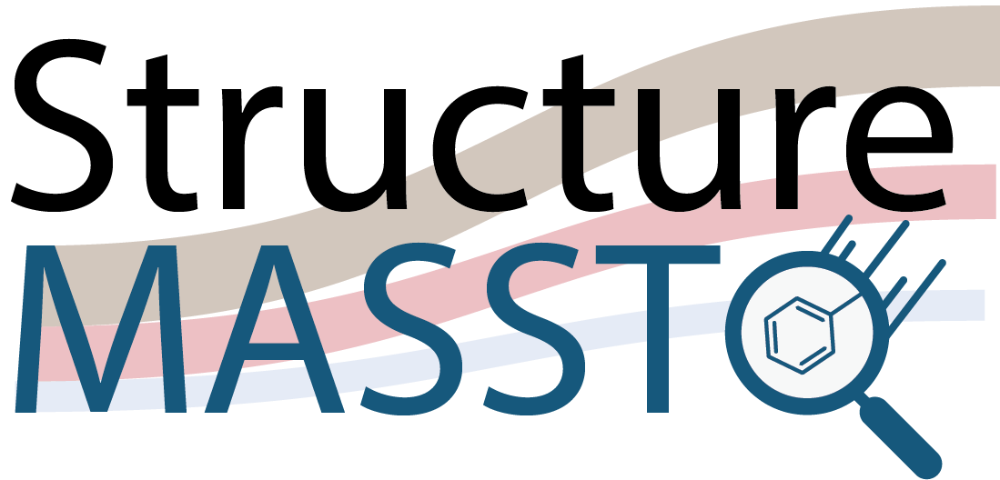

Feel free to use any of the following logos for your presentations and publications. The following logos are licensed as [CC BY](https://creativecommons.org/licenses/by/4.0/).

## GNPS2

[Download vector](img/logo/GNPS2_logo_blue-grey-black.ai)

## microbeMASST

[Download vector](img/logo/microbeMASST_logo.ai)

## microbiomeMASST

[Download vector](img/logo/microbiomeMASST_logo_3D.ai)

## plantMASST

[Download vector](img/logo/plantMASST_logo.ai)

## structureMASST

[Download vector](img/logo/structureMASST_logo.ai)

## GNPS2 FBMN

[Download vector](img/logo/mzmine-fbmn.ai)

## MassQL 

Find the full documentation for MassQL [here](https://mwang87.github.io/MassQueryLanguage_Documentation/)!

## GNPS2 Dashboard Logo

[Download vector](img/logo/dashboard_logo_final.ai)

## GNPS2 Pan ReDU

[Download vector](img/logo/panReDU_logo.svg)

