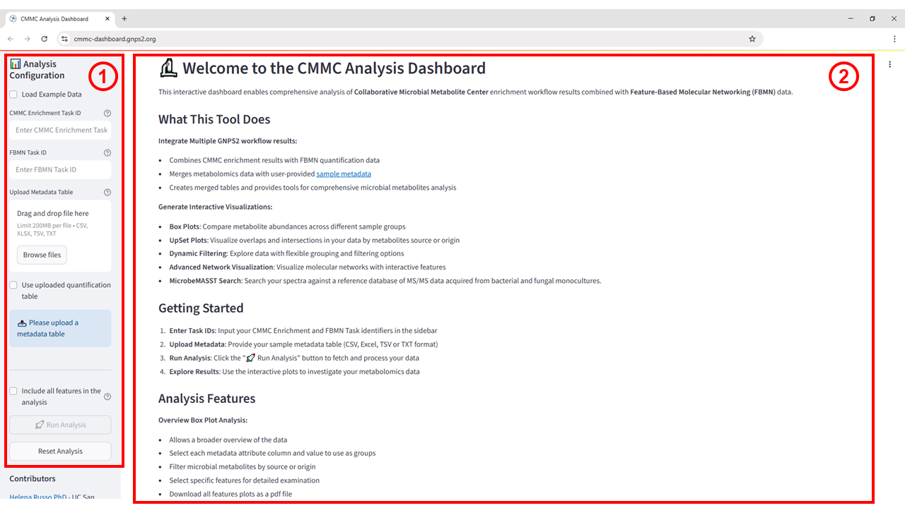
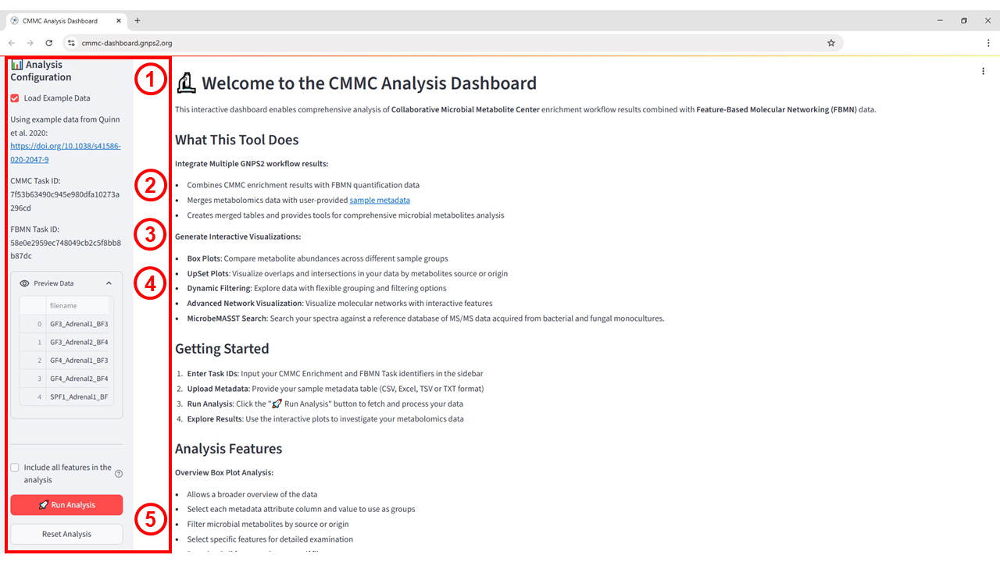
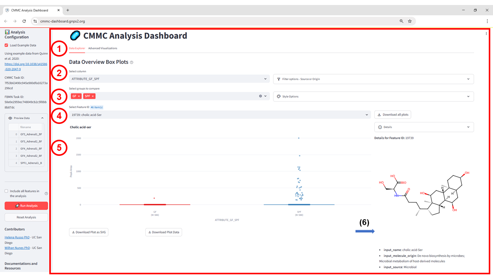
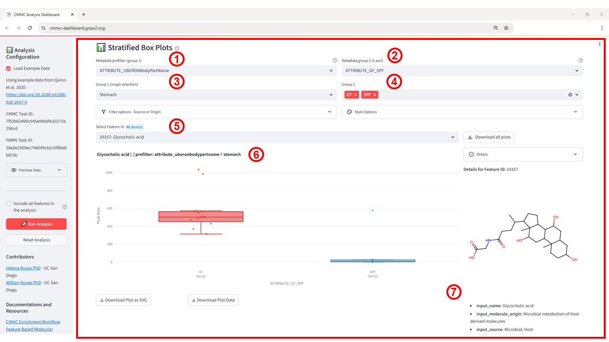
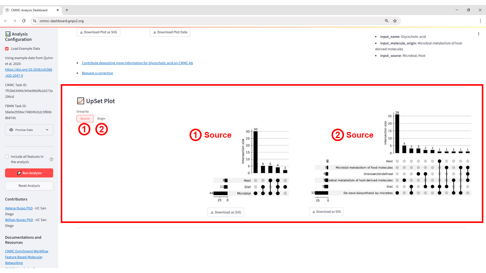
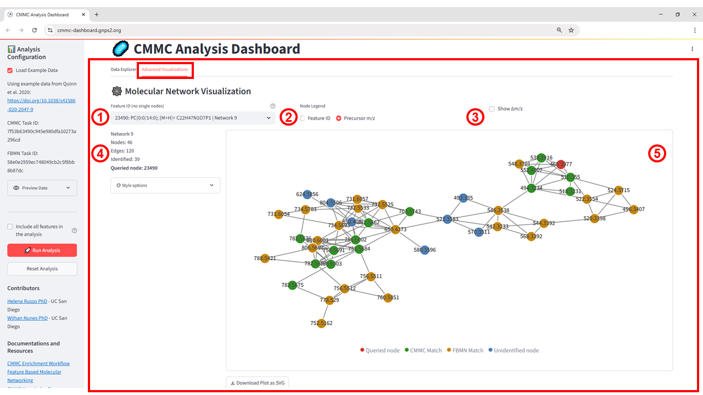

# CMMC Dashboard

## Purpose

The CMMC Analysis Dashboard is designed to streamline the exploration of microbial metabolite data by integrating outputs from GNPS2 workflows into a single, interactive environment. It consolidates CMMC enrichment results, FBMN quantification tables, and sample metadata, enabling seamless comparison, filtering, and visualization. Through its interactive modules ranging from statistical summaries to advanced molecular network and taxonomic visualizations. The dashboard provides researchers with actionable insights into the chemical diversity and microbial origins of their datasets.

## When to Use

Use the CMMC Analysis Dashboard after completing both the CMMC enrichment workflow and the FBMN workflow in GNPS2. It is most valuable when you want to:

* Combine enrichment results with quantitative FBMN data and metadata for integrated analysis.  
* Compare metabolite abundances between defined sample groups using box plots.  
* Identify unique or shared metabolites by source or origin with UpSet plots.  
* Explore structural relationships and potential novel compounds in molecular networks.  
* Map detected metabolites to microbial taxa through MicrobeMASST searches.

This tool is particularly suited for post-processing and hypothesis generation in microbial metabolomics studies where linking chemistry to taxonomy is a priority.

## Accessing the App

The CMMC Analysis Dashboard is available at [https://cmmc-dashboard.gnps2.org/](https://cmmc-dashboard.gnps2.org/). Once opened, the main interface is divided into two main sections:

1. **Analysis Configuration Sidebar** (left) \- where you load example data, enter CMMC and FBMN Task IDs, upload your metadata file, and set analysis parameters.  
2. **Main Display Panel** (right) \- where an overview of the tool, instructions, and the generated visualizations ara shown.

**Figure 1:** CMMC Dashboard interface. (1) Analysis configuration Sidebar \- input panel for Task IDs, metadata upload, and analysis settings. (2) Main Display Panel \- displays the tool description, usage instructions, and visual outputs.

## Input Requirements

To run the CMMC Analysis Dashboard, the following inputs are required:

1. **CMMC Enrichment Task ID**  \- The GNPS2 task identifier from a completed *CMMC Enrichment* workflow.  
2. **FBMN Task ID** \- The GNPS2 task identifier from a completed *Feature-Based Molecular Networking* workflow.  
3. **Sample Metadata Table** \- A file (CSV, Excel, TSV, or TXT) containing metadata for all samples in the FBMN dataset.

* The sample names in this file **must exactly match** the sample identifiers in the FBMN quantification table.  
* Include descriptive metadata columns (e.g., sample type, treatment group) to enable grouping and filtering in visualizations.

Workflows to generate the required **CMMC Enrichment** and  **FBMN** task IDs can be run at [GNPS2.org](http://GNPS2.org). For more details on running these workflows, refer to the documentation: [FBMN Documentation](https://wang-bioinformatics-lab.github.io/GNPS2_Documentation/fbmn/) and [CMMC Enrichment Documentation](https://cmmc.gnps2.org/network_enrichment/).

## Output Overview

The CMMC Analysis Dashboard produces the following outputs:

* **Data Overview Box Plots** \- Displays a boxplot for each detected feature based on the selected grouping column, enabling quick visual comparison of metabolite abundance distributions across groups.  
* **Stratified Box Plots** \- Allows a more granular comparison by stratifying the data using one metadata attribute (Group 1\) and selecting specific groups to visualize (Group 2).  
* **UpSet Plot** \- Visualizes the intersections and unique occurrences of microbial metabolites according to their source or origin, helping to identify shared and exclusive features.  
* **Molecular Network Visualization** \- Shows relationships between metabolites based on MS/MS spectral similarity, enabling exploration of chemical families and potential novel compounds.  
* **MicrobeMASST Search** \- Searches the detected spectra against a reference MS/MS database from bacterial and fungal monocultures, mapping features to their potential microbial origin.

All outputs are interactive and can be filtered, customized, and downloaded.

## Step-by-Step Instructions

### Step 1 – Open the Application

Go to [https://cmmc-dashboard.gnps2.org/](https://cmmc-dashboard.gnps2.org/). The interface has a **left sidebar** for inputs (Task IDs and metadata) and a **main panel** for outputs and instructions (see Figure 1).

### Step 2 – Enter the Task ID and Configure Analysis Parameters

In a real analysis scenario, the following inputs are required:

1. **CMMC Enrichment Task ID** – obtained from the GNPS2 CMMC Enrichment Workflow.  
2. **FBMN Task ID** – obtained from the GNPS2 Feature-Based Molecular Networking Workflow.  
3. **Sample Metadata Table** – matching the FBMN quantification table exactly.

**Tutorial Note:**  
For demonstration purposes, this guide uses the **built-in example dataset**. To load it, select **Load Example Data** from the input panel. This will automatically populate all required fields with example Task IDs and metadata. Once populated, click **Run Analysis** to execute the pipeline.

**Figure 2:** CMMC Analysis Dashboard interface with example dataset loaded. (1) Load Example Data: automatically populates all input fields with preconfigured Task IDs and metadata from the referenced study. (2) CMMC Task ID: identifier for the CMMC Enrichment Workflow. (3) FBMN Task ID: identifier for the Feature-Based Molecular Networking Workflow. (4) Preview Data: displays the filenames from the selected quantification table. (5) Run Analysis: executes the pipeline using the provided inputs and parameters.

**Step 3 – View the Results**

### Step 3 – View the Results

#### Data Overview Box Plots

**Figure 3:** Data Overview Box Plots interface in the CMMC Dashboard. (1) Data Explorer tab; (2) dropdown to select the metadata column used for grouping; (3) selection of groups to compare; (4) dropdown to select the metabolite by Feature ID; (5) box plot showing abundance distributions between selected groups; (6) metabolite details and chemical structure.

#### Stratified Box Plots

The Stratified Box Plots tab (see Figure 4\) enables a two-level grouping of metabolomics data, allowing deeper exploration of metabolite abundance patterns.

* Select the Metadata prefilter (group 1\) (1) to define the first grouping criterion (e.g., anatomical location, ATTRIBUTE\_UBERONBodyPartName).  
* Choose the Metadata group (group 2\) (2) to define the secondary grouping displayed on the x-axis (e.g., experimental condition ATTRIBUTE\_GF\_SPF).  
* Under Group 1 (3), select a specific subgroup from the first metadata attribute (e.g., Stomach).  
* Under Group 2 (4), choose the groups to compare within the stratified selection (e.g., GF and SPF).  
* Use Select Feature ID (5) to focus on a particular metabolite (e.g., Glycocholic acid).  
* The box plot (6) displays peak area distributions for each subgroup within the stratified selection, enabling detection of abundance differences conditioned on the first grouping criterion.  
* The right-hand panel (7) provides additional chemical and biological details for the selected metabolite, including name, origin, and source.

**Figure 4**: Stratified Box Plots interface in the CMMC Dashboard. (1) Selection of the first metadata attribute for prefiltering; (2) secondary metadata attribute used for the x-axis; (3) selection of a specific subgroup from Group 1; (4) selection of groups for comparison in Group 2; (5) metabolite selection by Feature ID; (6) box plot showing peak area distributions for Glycocholic acid in GF vs. SPF stomach samples; (7) detailed metabolite information and structure.

In the example, Glycocholic acid is substantially more abundant in the GF group compared to SPF when restricted to stomach samples. This view is particularly valuable for identifying group differences that emerge only within a specific metadata-defined context, such as organ-specific metabolite patterns or host–microbe interactions.

#### UpSet Plot

The UpSet Plot view (see Figure 5\) enables the visualization of intersections between metabolite sets grouped by either Source (1) or Origin (2).

* Source categorizes metabolites based on their general provenance, such as microbial, host, or diet.  
* Origin groups metabolites by their biosynthetic or metabolic origin, e.g., De novo biosynthesis by microbes, microbial metabolism of host-derived molecules, or microbial metabolism of food molecules.

In each panel, the vertical bars represent the size of the intersection (number of metabolites) corresponding to the connected black dots in the matrix below.

* A single filled dot without connections represents a unique set (metabolites belonging exclusively to that category).  
* Connected dots indicate metabolites shared across multiple categories, with the intersection size displayed as the height of the corresponding bar.

**Figure 5:** UpSet Plot visualization showing intersections grouped by Source (1) and Origin (2). Bars indicate intersection sizes (number of metabolites), while connected dots represent the categories included in each intersection. 

This plot helps identify overlapping biological or dietary origins of detected metabolites, providing insights into potential shared metabolic pathways or cross-domain chemical signatures.

#### Molecular Network Visualization

The Molecular Network Visualization view (see Figure 6\) enables the exploration of spectral similarity relationships among detected features, grouped into connected components (networks). Each node represents a feature (*m/z* value), and edges indicate high spectral similarity (cosine score) between features.

* Feature Info (1) \- Displays details for the selected feature/node, including its annotation, precursor ion, adduct, molecular formula, and the network it belongs to.  
* Node Legend (2) \- Allows switching between node labels as Feature ID or Precursor m/z.  
* Show Δm/z (3) \- When enabled, displays the mass difference between connected nodes directly on the edges.  
* Network Summary (4) \- Summary of the current network, including the total number of nodes, edges, and identified nodes, as well as the ID of the queried node.  
* Network Graph (5) \- Interactive visualization where:  
* Green nodes represent features matched to the CMMC enrichment results.  
  * Orange nodes represent FBMN matches without CMMC enrichment.  
  * Blue nodes represent unidentified features.  
  * Red node marks the queried feature.  
  * Edges indicate cosine similarity-based spectral matches between nodes.

**Figure 6:** Molecular Network Visualization showing spectral similarity relationships between features. Node colors correspond to annotation status (red: queried node, green: CMMC match, orange: FBMN match, blue: unidentified), and edges represent spectral similarity connections.

#### microbeMASST Search

The **microbeMASST Search** feature (see Figure 7\) enables users to link known or unknown MS/MS spectra to their potential microbiological producers. It leverages a curated database containing over 60,000 microbial monocultures (covering bacteria, fungi, and archaea) collected from diverse environments such as plants, soils, oceans, animals, and humans. By comparing the fragmentation pattern of a query spectrum to those in the GNPS/MassIVE repository, MicrobeMASST identifies matches and organizes them into an interactive **taxonomic tree**, making it easier to interpret the relationships between compounds and their microbial sources. This functionality provides unique insights into the ecological and health-related roles of microorganisms.

**How to Use the microbeMASST Search Interface**

1. Enter USI or Library ID \- Input the Universal Spectrum Identifier or the library ID for the spectrum you wish to search.  
2. Minimum Cosine Similarity \- Sets the similarity threshold for matching spectra (e.g., 0.70 ensures only strong matches are retrieved).  
3. Analog Mass Below (Da) \- Defines the lower bound for mass differences when searching analog matches.  
4. Precursor m/z Tolerance (ppm) \- The maximum deviation allowed between query and database precursor m/z values.  
5. Minimum Matched Peaks \- Minimum number of shared fragment ions required for a match.  
6. Analog Mass Above (Da) \- Defines the upper bound for mass differences in analog searches.  
7. m/z Fragment Tolerance (ppm) \- The maximum allowed deviation for fragment ions.  
8. Run Search \- Executes the search based on the parameters defined above.  
9. Results Panel \- Displays a hierarchical taxonomic tree of matched microorganisms, from domain to strain level. Yellow circles represent matched taxa, with each branch reflecting taxonomic relationships.

**Figure 7:** Example of a taxonomic tree generated by MicrobeMASST, showing the matched microbial taxa for a queried MS/MS spectrum. Nodes represent taxonomic levels from domain to strain, with yellow nodes indicating matches.

In the example shown, the query spectrum is matched to multiple microbial taxa, organized from **root** → **domain** → **order** → **family** → **genus** → **species** → **strain**. This hierarchical view helps the user identify the likely microbial origin of the metabolite, narrowing down potential producers without requiring prior taxonomic knowledge.