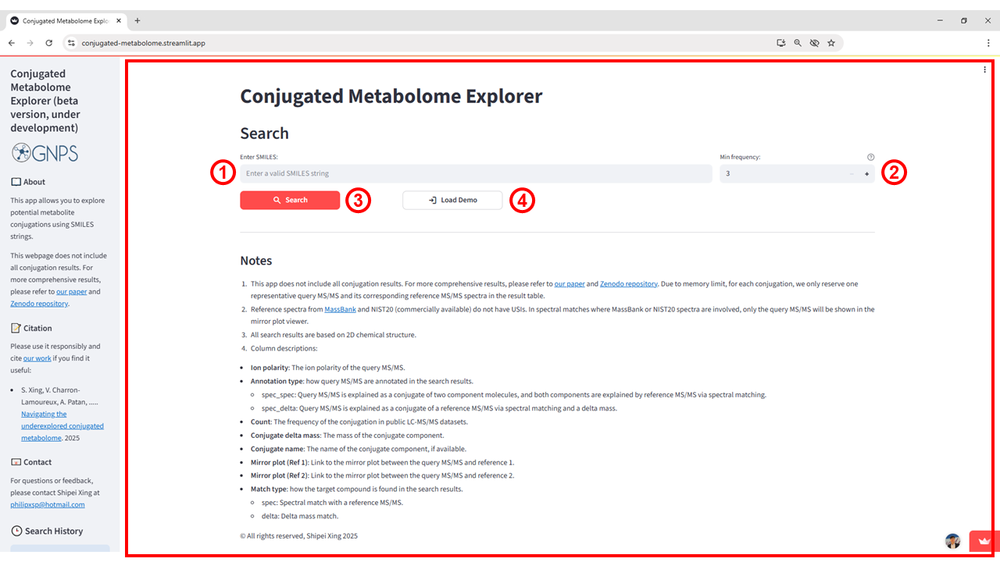
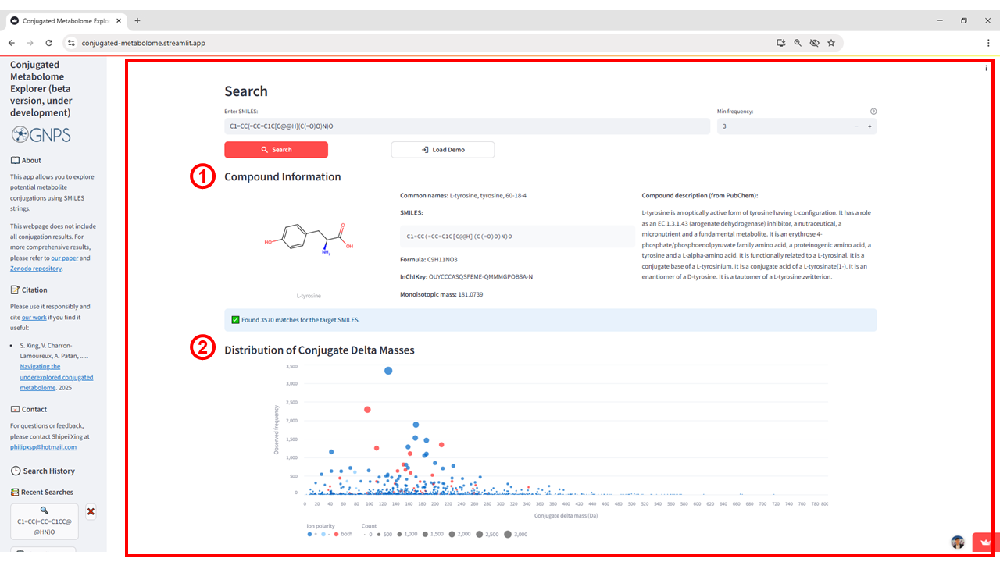
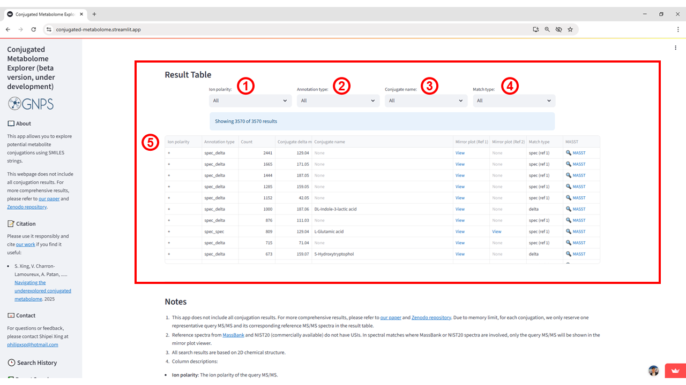

# Conjugated Metabolome Explorer

## Purpose

The **Conjugated Metabolome Explorer** enables the systematic investigation of potential metabolite conjugations across public metabolomics repositories using 2D chemical structures provided as SMILES strings. It searches public LC-MS/MS datasets for conjugated forms of a given molecule, employing spectral matching and delta mass relationships to annotate potential conjugation partners. 

## When to Use

The **Conjugated Metabolome Explorer** is designed to assess the occurrence of conjugated forms of a metabolite of interest across public LC-MS/MS datasets. It is particularly suited for analyses starting from a known chemical structure (SMILES), enabling the detection of structural modifications involving small molecules or other conjugated forms.

## Accessing the App

The Conjugated Metabolome Explorer (see Figure 1) can be accessed directly at [https://conjugated-metabolome.gnps2.org/](https://conjugated-metabolome.gnps2.org/). No login or registration is required.

## Input Requirements

To run an analysis in the Conjugated Metabolome Explorer, users must provide the following:

1. SMILES string \- A valid SMILES representation of the compound of interest must be entered in the input field. This is the primary query used to search for potential conjugations in public LC-MS/MS datasets.  
2. Minimum frequency \- Defines the minimum number of occurrences for a given conjugation in the public domain to be included in the results. This parameter can be adjusted to refine the search, with higher values reducing noise from rare events.

Alternatively, users can click Load Demo to automatically populate the input fields with example data for testing and familiarization with the app.

## Output Overview

After executing the analysis, the app generates a set of outputs that summarize and visualize potential metabolite conjugations. These include a chemical profile of the input compound, graphical summaries of conjugation patterns, and an interactive table for detailed inspection and filtering of results. Together, these outputs allow users to quickly identify common conjugation masses, explore polarity-specific trends, and access supporting spectral matches.

## Step-by-Step Instructions

### Step 1 – Open the Application

Go to [https://conjugated-metabolome.gnps2.org/](https://conjugated-metabolome.gnps2.org/). You will see the main input panel (see Figure 1\) with a **SMILES** field (1), a **Min frequency** control (2), and buttons to **Search** (3) or **Load Demo** (4).

**Figure 1:** Initial interface of the Conjugated Metabolome Explorer. (1) Field to enter a valid SMILES string for the query. (2) *Min frequency* parameter to filter conjugations by their occurrence in public LC-MS/MS datasets. (3) Search button to run the analysis. (4) Load Demo button to populate the input fields with example data.

### Step 2 – Use the built-in example and run the search**

You can either click **Load Demo** (see Figure 1, 4\) to automatically populate the SMILES field with an example compound and immediately run the analysis, or manually enter your own SMILES string, adjust the *Min frequency* parameter if needed, and click **Search**. The results will be generated and displayed directly below the input panel.

### Step 3 – View the Results**

After the analysis runs, the first panel displayed is **Compound Information**. Here, you will find the structure of the queried compound along with key identifiers such as common names, SMILES, molecular formula, InChIKey, monoisotopic mass, and a compound description sourced from PubChem. This section also reports the total number of matches found for the provided SMILES.

Directly below, the **Distribution of Conjugate Delta Masses** plot summarizes the observed frequency of different conjugate mass shifts in public datasets. The x-axis represents the conjugate delta mass (Da), while the y-axis shows how often each was observed. Each point is colored according to ion polarity (positive, negative, or both), and its size reflects the number of counts, enabling quick identification of the most prevalent conjugation patterns.

**Figure 2:** Results from the Conjugated Metabolome Explorer showing: (1) Compound Information, including structural representation, identifiers, and compound description from PubChem, along with the number of matches for the queried SMILES; and (2) Distribution of Conjugate Delta Masses, where each point represents a conjugate mass shift, colored by ion polarity and sized according to its observed frequency in public datasets.

The **Result Table** (see Figure 3\) compiles all detected conjugation matches for the queried SMILES, allowing users to filter results by ion polarity (1), annotation type (2), conjugate name (3), and match type (4). Each row (5) represents a single conjugation instance, with key details to support interpretation:

* Annotation type distinguishes between spec\_spec matches (both conjugate components have direct spectral matches) and spec\_delta matches (one component annotated by spectral match, the other inferred by delta mass).  
* Count shows how frequently the conjugation occurs in public LC-MS/MS datasets.  
* Conjugate delta mass is the mass of the conjugated component, while Conjugate name provides its assigned name when available.  
* Mirror plot (Ref 1/Ref 2\) links allow visual inspection of spectral matches between the query and reference MS/MS spectra using their Universal Spectrum Identifiers (USIs).  
* Match type indicates whether the match is purely spectral match (spec) or based on delta mass (delta).

**Figure 3:** Result Table interface: (1) ion polarity filter; (2) annotation type filter; (3) conjugate name filter; (4) match type filter; and (5) main table showing matches with annotation type, count, conjugate delta mass, conjugate name, mirror plot links, match type, and MASST link.
