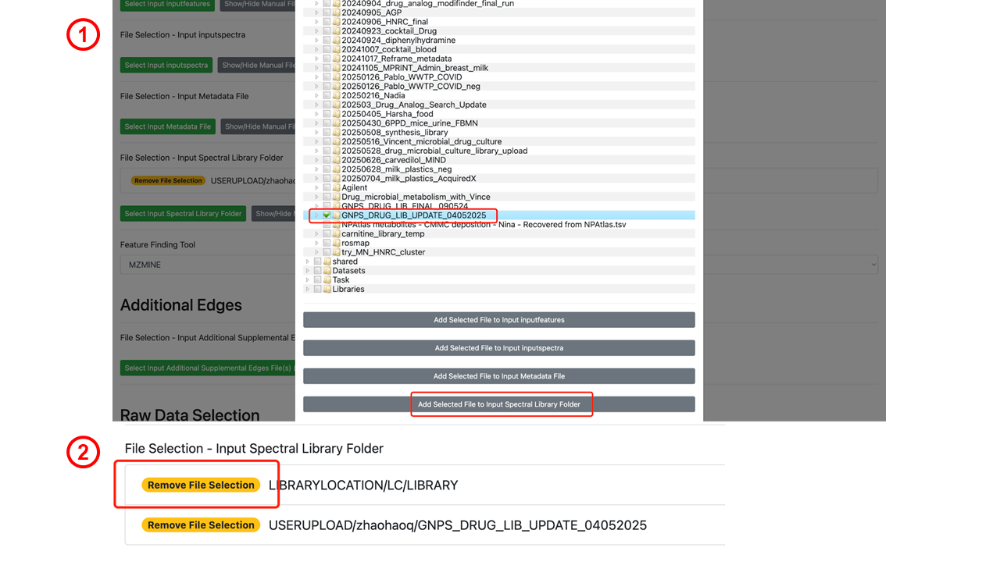
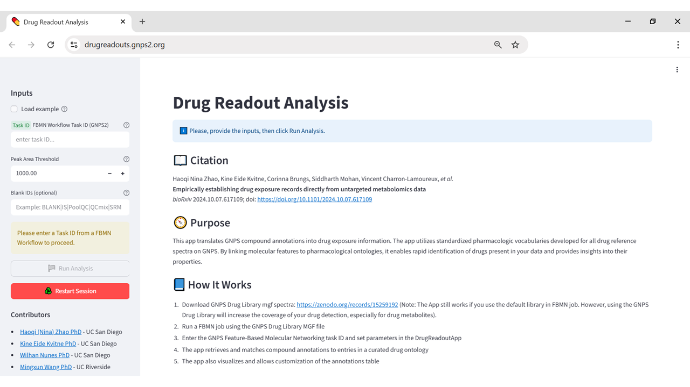
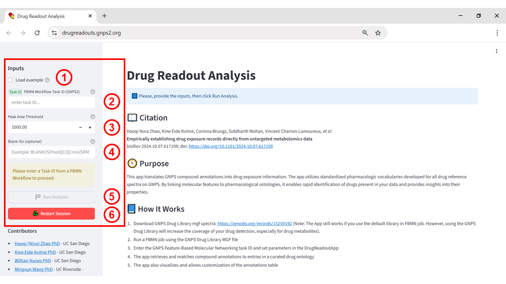
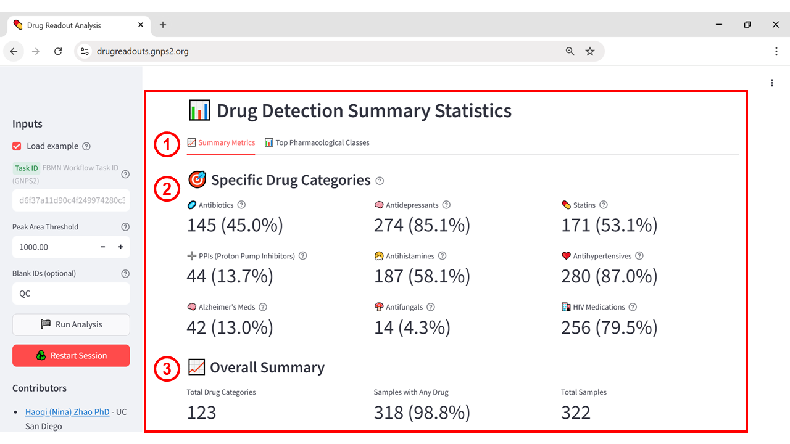
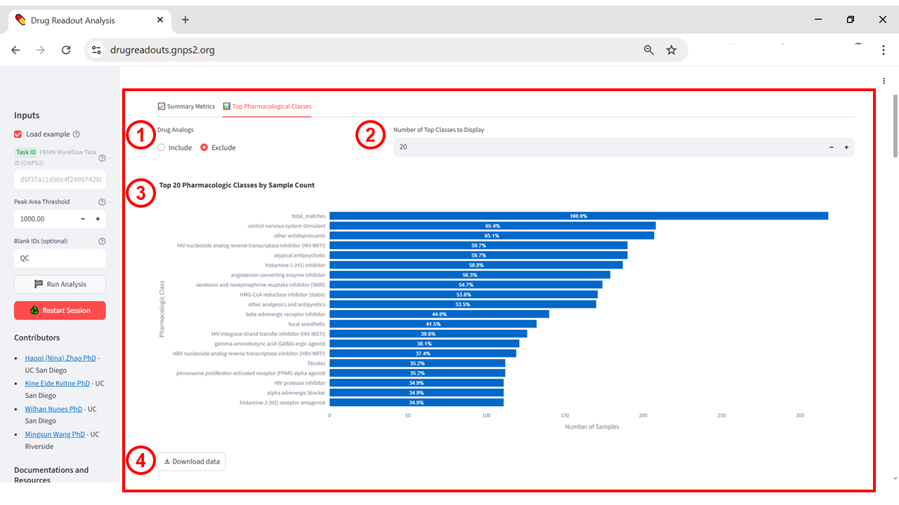
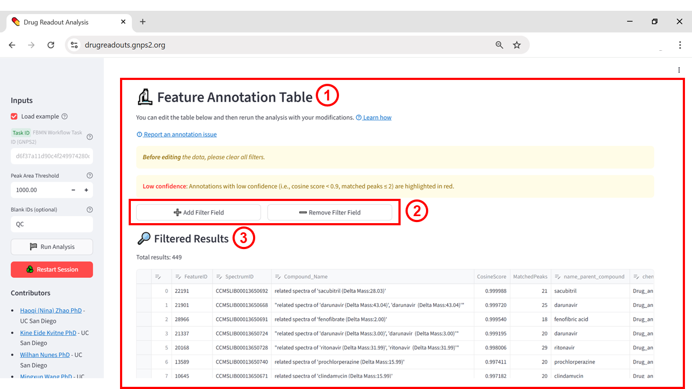
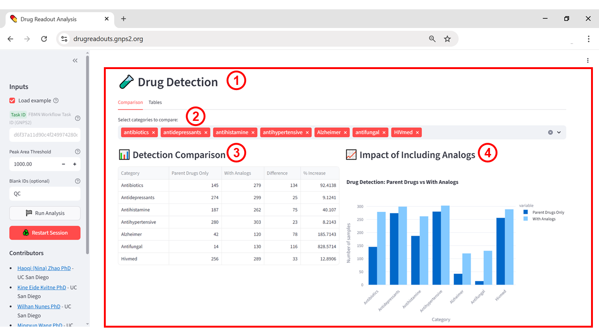
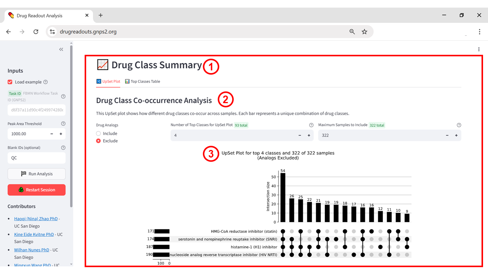
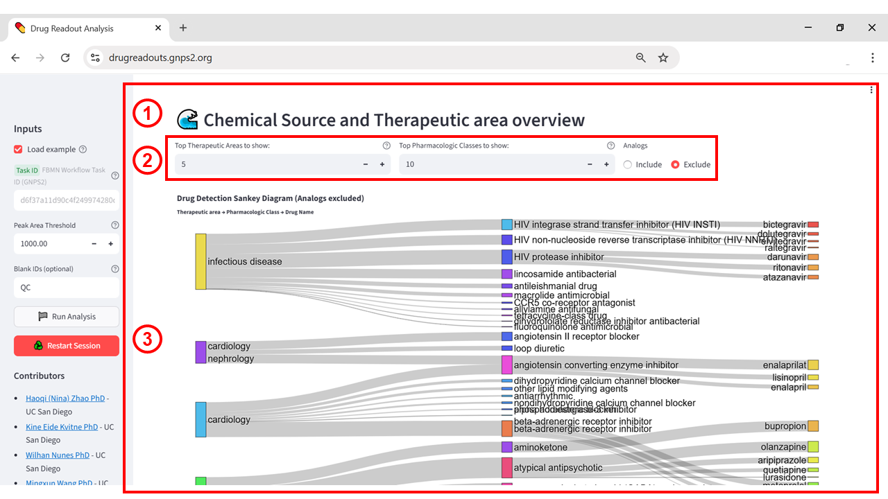

# Drug Readout

## Purpose

The Drug Readout App streamlines the detection and annotation of drugs and their metabolites in untargeted LC-MS/MS datasets by leveraging the curated GNPS Drug Library. This resource contains reference spectra for both parent drugs and structurally related metabolites/analogs, enriched with structured metadata including exposure source, therapeutic class, pharmacologic class, therapeutic indication, and mechanism of action. By integrating chemical annotation with rich metadata, the app enables researchers to rapidly generate interpretable drug exposure profiles from untargeted metabolomics experiments facilitating downstream analysis.

## When to Use

Use the Drug Readout App to identify and interpret drug exposures directly from untargeted metabolomics data. The drug readout is especially valuable if information on medication use is unavailable or incomplete, or for stratifying cohorts based on specific drug classes (e.g., antibiotics, antifungals), detecting unreported exposures (e.g. over-the-counter and recreational drugs, non-adherence) or environmental exposures, and retrospectively assessing pharmacologic influences on metabolic or microbiome profiles.

## Accessing the App

* URL: [https://drugreadouts.gnps2.org/](https://drugreadouts.gnps2.org/) 

* Also accessible from the **Downstream Analysis** section of FBMN job pages in GNPS2.

## Input Requirements

* GNPS2 Task ID for a completed FBMN job (we recommend using the GNPS Drug Library mgf to increase the coverage of your drug detection, especially for drug metabolites. Spectral library can be downloaded from https://zenodo.org/records/15259192).

* Peak Area Threshold – only detections with peak area above this value will be considered

* Blank IDs (optional) – substrings to identify blank or control columns, separated by a pipe (“|”) character. If provided, these columns will be removed from the analysis. Otherwise, all columns will be included.

## Step-by-Step Instructions

### Step 0 – Download the GNPS Drug Library mgf and run the FBMN job

Download the two mgf files from [https://zenodo.org/records/15259192](https://zenodo.org/records/15259192). Specifically, “GNPS_Drug_Library_Spectra_Drugs_and_Metabolites.mgf” contains reference spectra for drugs and known drug metabolites collected from the GNPS Spectral Library and MSnLib. “GNPS_Drug_Library_Spectra_Drug_Analogs.mgf” contains MS/MS spectra of propagated drug analogs, which were developed by spectral alignment against ~3,500 publicly accessible untargeted metabolomics datasets. We recommend including both mgf files in the FBMN job. Users will have the option to include or exclude analog matches in the Drug Readout App.

Upload the mgf files to your personal GNPS2 account. Then use these two mgf files as the Input Spectral library for your FBMN job (Figure 1).

**Figure 1:** Example of selecting the GNPS Drug Library as input in the Feature-Based Molecular Networking workflow. (1) In the File Selection – Input Spectral Library Folder section, choose the desired library folder and click “Add Selected File to Input Spectral Library Folder.” (2) Confirm that the selected files appear in the File Selection – Input Spectral Library Folder list.

### Step 1 – Open the application

Navigate to the Drug Readout App URL: [https://drugreadouts.gnps2.org/](https://drugreadouts.gnps2.org/)

**Figure 2:** Landing page of the Drug Readout App showing the main input panel (left)

### Step 2 – Enter the Task ID and configure analysis parameters

In this step, users can either load the example dataset provided in the app or enter their own GNPS2 FBMN Workflow Task ID. The *Peak Area Threshold* defines the minimum peak area required for a detection to be considered (default: 1000). Optionally, users can specify one or more substrings in the *Blank IDs* field (separated by “|”) to identify and exclude blank or control samples from the analysis (e.g., entering “QC” will remove all columns with “QC” in their name). If no blank IDs are provided, all columns will be included in the analysis.

**Figure 3:** Input panel of the *Drug Readout Analysis* app showing the configuration fields. (1) **Load example** – loads a preconfigured dataset for demonstration; (2) **Task ID** – field to enter the GNPS2 FBMN Workflow Task ID; (3) **Peak Area Threshold** – minimum peak area for detections to be included in the analysis (default: 1000); (4) **Blank IDs** – substrings to identify specific sample columns in the input table; (5) **Run Analysis** – starts the analysis with the provided parameters; (6) **Restart Session** – resets all fields and clears the session to start a new analysis from scratch.

### Step 3 – View the Results

#### Summary Metrics Tab

This initial view summarizes the detection of certain classes of  drugs across all samples (Supplementary Figure X). The *Specific Drug Categories* panel lists counts for predefined therapeutic groups (e.g., antibiotics, antidepressants, antihypertensives, proton pump inhibitors, statins, among others). The *Overall Summary* section displays the total number of unique drug classes detected (based on FDA pharmacologic classification), the number of samples containing at least one drug, and the total number of samples analyzed. These metrics allow rapid assessment of overall drug exposure in the dataset.

**Figure 4:** Drug Detection Summary Statistics panel. **(1)** Summary Metrics tab selected to provide an overview of detection results. **(2)** Specific Drug Categories displays the number and percentage of samples containing drugs from selected therapeutic classes (e.g., antibiotics, antidepressants, statins, among others). **(3)** Overall Summary reports the total number of detected drug categories, the number and percentage of samples containing any drug, and the total number of samples analyzed.

#### Top Pharmacological Classes Tab

The **Top Pharmacological Classes** tab (Supplementary Figure X, 1\) displays the most frequently detected drug classes in the dataset. The **Drug Analogs** option (Supplementary Figure X, 2\) allows users to choose whether to include or exclude drug analog matches from the analysis. The **Number of Top Classes to Display** (Supplementary Figure X, 3\) defines how many classes will be shown in the plot. All underlying data can be exported for downstream analysis using the **Download data** button (Supplementary Figure X, 5).

**Figure 5: Top Pharmacological Classes panel.** (1) **Top Pharmacological Classes tab** selected to display the most frequent drug classes in the dataset. (2) **Drug Matching filter** to include or exclude specific drug annotations in the counts. (3) **Number of Top Classes to Display** allows adjustment of how many classes are shown in the bar chart. (4) **Bar plot** showing the top pharmacological classes ranked by the percentage and number of samples containing at least one drug from each class. (5) **Download data button** to export the table underlying the plot for downstream analysis.

#### Feature Annotation Table

The Feature Annotation Table lists all detected features that match entries in the reference drug databases. Each row corresponds to a feature, showing:

* Feature ID and Spectrum ID – identifiers for tracking the feature in GNPS2 and related workflows.

* Compound Name – the matched drug or analogs, sometimes including delta mass values when the match is to a derivative.

* Cosine Score – a measure of spectral similarity between the detected feature and the reference spectrum (values closer to 1.0 indicate higher confidence).

* Matched Peaks – the number of fragment ions that matched between the feature and the reference spectrum (higher counts generally mean more reliable matches). Annotations highlighted in **red** indicate *low confidence* matches (cosine score \< 0.9 or ≤ 2 matched peaks) and should be interpreted with caution.

* Name\_parent\_compound \- useful for drug metabolites to identify the parent drug.

* Chemical source \- exposure sources of the chemical (as a combination of endogenous, food, medical, personal care, industrial). Useful to exclude chemicals with medical use that could also come from endogenous or food sources.

* Pharmacologic class, therapeutic area, therapeutic indication: pharmacologic information about the drug, useful for downstream analysis.

You can use the **Add Filter Field** option to display specific compounds, drug classes, scores, or thresholds.  You could also delete certain rows in the table, for example to exclude unconfident annotations. After editing, click “Rerun Analysis with Edited Data”, and all the results will be updated. 

**Figure 6:** Feature Annotation Table. (1) Main results table showing matched drug annotations with associated metadata. (2) Filter controls to narrow the displayed results based on user-defined conditions. (3) Current number of results matching the applied filters.

#### Drug Detection

The *Comparison* tab provides an overall of detections with and without drug analogs. In the Drug Detection section (Supplementary Figure S19), users can first select the drug categories they wish to examine from the category selector at the top of the panel. Once selected, these categories populate the Detection Comparison table, which reports the number of samples containing only the parent drug and numbers  when analogs are also included. We also provide a bar plot to visualize these results. The *Table* tab provides detection of the drug classes in each sample in a tabulated format.![][image7]

**Figure 7:** Drug Detection panel. (1) Main section displaying drug detection results; (2) selection of drug categories for comparison; (3) detection comparison table showing counts with and without analogs; (4) bar plot illustrating the impact of including analogs.

#### Drug Class Summary

The *Drug Class Summary* section provides an overview of how drug classes co-occur across the analyzed samples. The *Drug Class Co-occurrence Analysis* uses an UpSet plot to visualize unique combinations of drug classes, where each bar represents the number of samples containing that specific combination. Users can choose to include or exclude drug analogs from the analysis and can adjust the number of top classes displayed, as well as the maximum number of samples considered in the plot. This view helps identify common co-occurrence patterns that may be biologically or clinically relevant.

**Figure 8:** Drug Class Summary tab. (1) Main section displaying drug class co-occurrence analysis; (2) controls for including/excluding analogs, selecting number of top classes, and setting maximum samples; (3) UpSet plot showing unique combinations of drug classes across samples.

#### Chemical Source and Therapeutic Area Overview

The Chemical Source and Therapeutic Area Overview provides a Sankey diagram summarizing the drug detections  based on therapeutic areas, pharmacological classes, and detected drug names. Widths of the bars and links are proportional to numbers of samples detected in this class. Users can control how many therapeutic areas and pharmacological classes are displayed, as well as whether drug analogs are included or excluded from the visualization. 

**Figure 9**: Chemical Source and Therapeutic Area Overview tab. (1) Main section with Sankey diagram visualization; (2) controls for number of therapeutic areas, number of pharmacological classes, and inclusion/exclusion of analogs; (3) Sankey diagram linking therapeutic areas to pharmacological classes and drug names.
