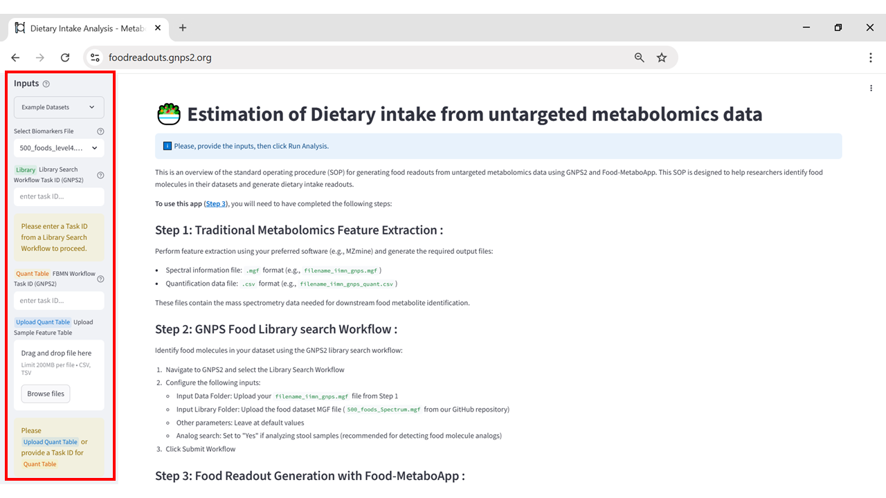
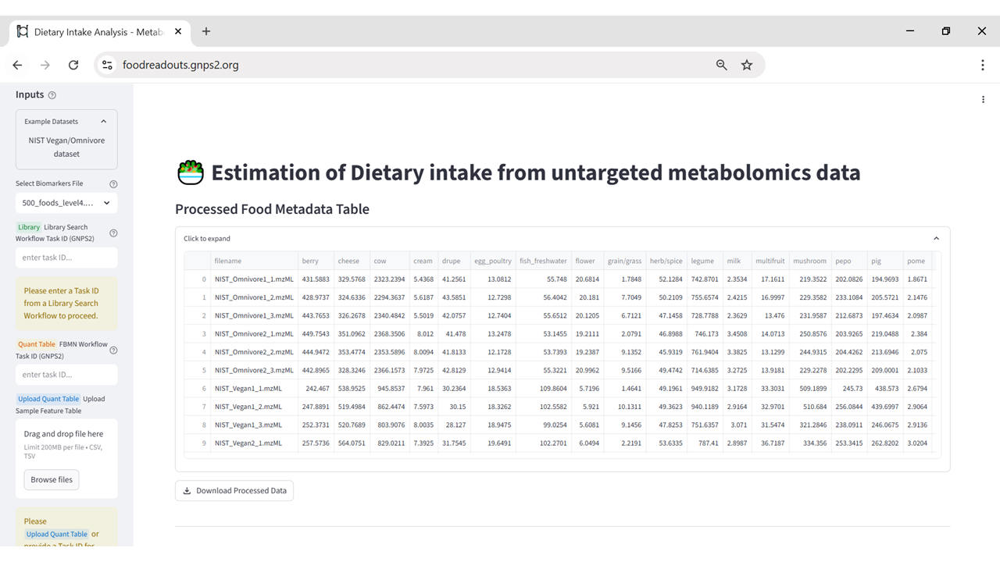
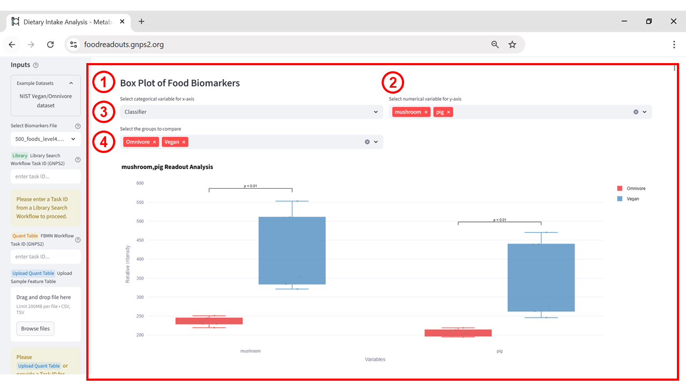
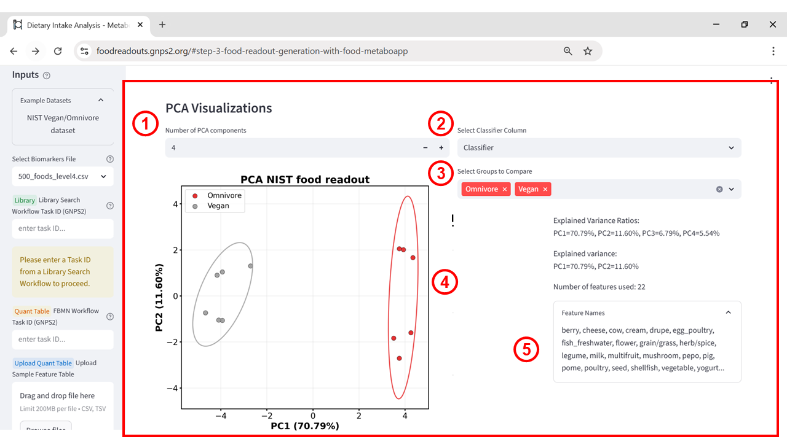
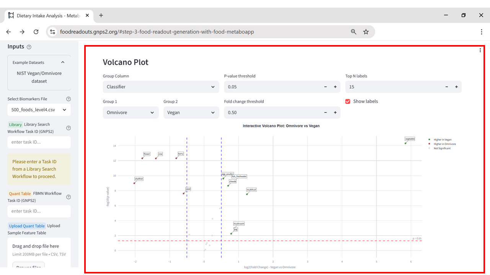

# Food Readout

## Purpose

The Food Readout app identifies and summarizes food-derived compounds detected in untargeted metabolomics datasets, enabling researchers to estimate dietary intake patterns directly from LC-MS/MS data. By matching experimental spectra against the GNPS Library and a curated Food metadata table, and organizing the results into structured food ontology categories, the app provides an interpretable overview of potential dietary exposures for downstream nutritional and biomedical analysis.

## When to Use

The Food Readout app is designed for untargeted metabolomics datasets acquired by LC-MS/MS, where the goal is to identify features matching known food-derived molecules. It can be applied in contexts such as nutrition and dietary intervention studies, microbiome-diet interaction research, food authenticity and safety monitoring, and broader exposome analyses. However, results should be interpreted with caution: the GNPS spectral library is not exhaustive, many metabolites are shared between food and non-food sources, and detection does not necessarily reflect recent consumption or absolute intake levels.

## Accessing the App

The Food Readout app can be accessed directly via its web interface at [https://foodreadouts.gnps2.org/](https://foodreadouts.gnps2.org/). No GNPS account is required for viewing results, but you will need the GNPS2 Task ID from a completed library search job (or you can load the built-in example dataset). The interface is designed for straightforward use, with clearly labeled input fields and tooltips that provide additional guidance.

## Input Requirements

To run the Food Readout analysis, three inputs are required:

* GNPS2 Task ID \- The identifier for a completed GNPS2 FBMN workflow containing matches against the GNPS libraries.  
* Quantification Table \- A .csv or .tsv file with peak area or intensity values for each detected feature across samples. This should match the features in the Task ID’s results.  
* Metadata Table \- A .csv or .tsv file containing sample information (e.g., experimental groups, collection dates, dietary interventions). It must include a column that matches the sample names in the quantification table exactly.

These inputs allow the app to map detected food-related molecules to your dataset and generate dietary readouts in the context of your study design.

## Output Overview

The Food Readout app generates visual and tabular outputs that help interpret the occurrence and distribution of food-related metabolites in your untargeted LC–MS/MS dataset. These include:

* Box Plots of Food Biomarkers \- displays the abundance distribution of selected food biomarkers across samples or groups, making it easy to compare dietary signatures.  
* PCA Visualizations \- Principal Component Analysis plots showing clustering or separation of samples based on their food metabolite profiles.  
* Volcano Plot \- Highlights food biomarkers that differ significantly between groups, plotting fold change against statistical significance.  
* Downloadable Results \- All plots and processed tables can be exported for custom analysis or inclusion in reports.

These outputs provide a compact yet powerful view of dietary intake patterns inferred from metabolomics data.

## Step-by-Step Instructions

### Step 1 – Open the application

Navigate to the Food Readout app at [https://foodreadouts.gnps2.org](https://foodreadouts.gnps2.org). The interface includes fields for your GNPS task ID, quantification table, and metadata table.

**Figure 1:** Food Readout App interface showing the input panel (blue box on the left), including fields for selecting the biomarker file, entering the GNPS2 library search Task ID, uploading the quantification table, and metadata table. The “Example Datasets” dropdown allows quick loading of preconfigured datasets for demonstration purposes.

### Step 2 – Enter the Task ID and configure analysis parameters

In this tutorial, we will use the ***NIST Vegan/Omnivore dataset*** available directly within the app.

* Click the Example Datasets tab in the top menu.  
* Select the NIST Vegan/Omnivore dataset.  
* This will automatically populate the Task ID, quantification table, and metadata table fields for you.

In a real analysis, you would instead:

* Enter your own Task ID from a GNPS2 Library Search workflow.  
* Upload your Quantification Table (CSV format) containing feature intensities.  
* Upload a Metadata Table with sample information (must contain a “filename” column matching your quantification table).

**Figure 2:** Example dataset selection in the Food Readout App. The “Example Datasets” dropdown (blue box) is set to NIST Vegan/Omnivore dataset, allowing users to load preconfigured input data for demonstration and testing without the need to manually upload files.

### Step 3 – View the Results

#### Processed Food Metadata Table

The first output generated by the Food Readout App is the Processed Food Metadata Table. This table displays the estimated relative abundances for different food categories detected in the dataset, organized by sample (filename). Each column corresponds to a specific food category (e.g., berry, cow, mushroom), and the numerical values represent the aggregated intensity of characteristic metabolites for that category, calculated from mass spectrometry peak quantification.

**Figure 3:** Processed Food Metadata Table generated by the Food Readout App, showing estimated relative abundances for different food categories across samples. Columns represent food categories and rows correspond to individual samples in the dataset.

This output can be used to identify dietary patterns, compare food profiles between experimental groups, and perform further statistical analyses. The processed data can be downloaded for integration into external analysis workflows in R or Python.

#### Box Plot of Food Biomarkers

The Box Plot of Food Biomarkers visualization allows users to compare the relative abundances of selected food categories between groups.

* **(1)** Select categorical variable for x-axis: Choose the grouping variable from the metadata file (e.g., diet type).  
* **(2)** Select numerical variable for y-axis: Select one or more food categories from the processed metadata table to plot.  
* **(3)** Select the groups to compare: Define which groups within the chosen categorical variable should be contrasted (e.g., Omnivore vs. Vegan).  
* **(4)** Plot output: Displays box plots for each selected food category, with statistical comparisons between groups (e.g., p-values). The y-axis shows relative intensity values from the quantification data, allowing visual identification of differences in dietary biomarkers between groups.

**Figure 4:** Box Plot of Food Biomarkers generated by the Food Readout App. (1) Select categorical variable for x-axis, (2) select numerical variable(s) for y-axis, (3) choose groups to compare, and (4) resulting box plots. The example shows the relative intensities of “mushroom” and “pig” biomarkers in omnivore (red) and vegan (blue) samples, with p-values indicating statistically significant differences.

This plot is particularly useful for quickly identifying food categories that differ significantly between experimental or dietary groups, helping guide further statistical or biological interpretation.

#### PCA Visualization

The PCA Visualizations section provides an unsupervised multivariate analysis to explore patterns and separation between sample groups based on their food biomarker profiles. In the example shown below, principal component 1 (PC1) explains 70.79% of the variance and principal component 2 (PC2) explains 11.60%, with samples clearly clustering according to dietary classification (omnivore vs. vegan). This plot helps identify global differences in dietary intake patterns, while the feature list indicates which biomarkers contribute most to the observed separation.

**Figure 5:** PCA Visualizations interface. (1) Select number of PCA components, (2) choose classifier column, (3) define groups to compare, (4) PCA score plot showing sample clustering by diet type, and (5) feature list contributing to separation.

#### Volcano Plot Visualization

The Volcano Plot visualization (Figure 6) combines statistical significance (p-value) and fold change to identify food biomarkers that differ between groups. Points to the right represent biomarkers more abundant in vegans, and those to the left are more abundant in omnivores. The red horizontal dashed line marks the p-value threshold (default 0.05), while the blue vertical dashed lines indicate the fold change cutoff. This plot helps highlight the most discriminative biomarkers between dietary groups.

**Figure 6:** Volcano Plot interface. Users can adjust p-value threshold, fold change threshold, number of top labels, and groups to compare. Points in green indicate biomarkers higher in vegans, red indicates higher in omnivores, and gray indicates no significant difference.

## External Analysis and Support

Users can export food readout results in CSV or TSV format for further analysis. These files can be processed in R or Python to generate publication-ready visualizations, perform advanced statistical analyses, or integrate with other datasets. The Food Readout App is part of the GNPS downstream analysis ecosystem, *MetaboApps*. For questions, bug reports, or feature requests, users are encouraged to contact the app maintainers.

