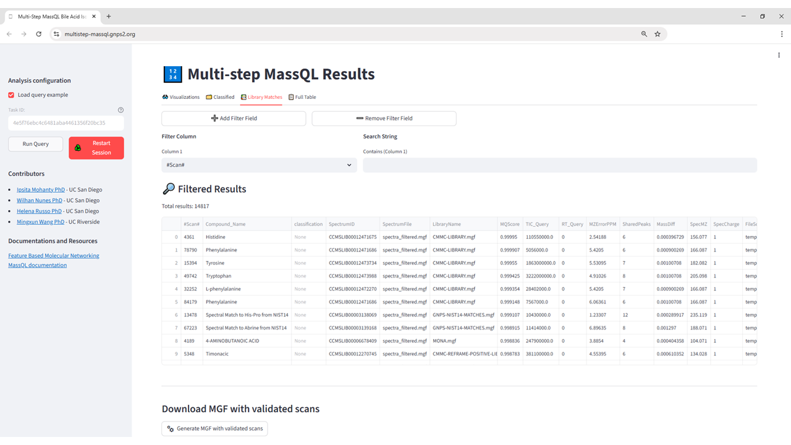

# Multi-Step MassQL

## Purpose

The Multi-step MassQL app allows users to run sequential MassQL queries on the clustered MGF (consensus spectra) generated from GNPS2 Classical or Feature-Based Molecular Networking (CMN/FBMN) jobs. By sequentially using multiple query conditions, users can refine candidate detection (e.g., first filtering for a general fragment, then narrowing to specific isomers), making it especially useful for exploring structurally related features such as bile acid isomers.

## When to Use

While it will be further expanded to other metabolite classes, currently, please use this app exclusively when working with datasets in which bile acids and their isomers are expected or of interest. It is particularly valuable for:

* Detection of bile acids within untargeted metabolomics datasets.  
* Confident annotation of structural and stereo isomers through a validated multi-step MassQL query sequence tuned to the characteristic MS/MS fragmentation signatures of bile acids.  
* Enhancing reproducibility in bile acid annotation by applying the same standardized detection logic across multiple datasets.

* Expanding the annotated chemical space of bile acids by assigning stereo and regioisomers for the steroid cores by only using MS/MS spectra.

## Accessing the App

* URL: [https://multistep-massql.gnps2.org/](https://multistep-massql.gnps2.org/)  
* Also accessible from the **Downstream Analysis** section of FBMN job pages in GNPS2.

## Input Requirements

* GNPS2 Task ID from a completed, public CMN or FBMN job  
* Or select “**Load query example**” to run the pipeline on a demonstration dataset.

## Step-by-Step Instructions

### Step 1 – Open the Application

Open the app in your browser using the direct URL: [https://multistep-massql.gnps2.org/](https://multistep-massql.gnps2.org/)

**Figure 1:** Initial interface of the Multi-step MassQL Bile Acid Isomer Annotation App. The application is pre-configured with a validated sequence of MassQL queries for the detection and annotation of bile acid isomers. Users can input their own FBMN task ID or load an example dataset to run the analysis without manually defining queries.

### Step 2 – Enter the GNPS2 Task ID

Paste your Task ID into the field labeled “**FBMN task ID:**”. This will fetch the clustered MGF associated with your molecular networking job. Make sure the job is public; otherwise, the app will not be able to access the data. Alternatively, click **“Load example dataset”** to test the app.

### Step 3 – Running the Analysis

Click “**Run Query**”. The pre-configured bile acid MassQL queries will automatically be applied to the consensus MGF file from your job. No query editing is required.

### Step 4 – View the Results

Once the analysis is complete, the **Multi-Step MassQL Results** page displays four tabs: **Visualizations, Classified, Library Matches,** and **Full Table**.

**Figure 2:** Interface of the Multi-step MassQL Bile Acid Isomer Annotation App upon completion of the analysis. The blue rectangle highlights the location of the four main result tabs (Visualizations, Classified, Library Matches, and Full Table).

#### Visualizations Tab

The **Visualizations** tab (Figure 3) presents the **Bile Acid Classification Tree** for each detected feature. Users can select a feature from the dropdown list to view its “classification”, which is highlighted in the tree. In case of more than one classification (if the features satisfy more than one MassQL isomer query, which can happen if it is a chimeric spectrum) – all classifications will be provided in the dropdown menu. 

**Figure 3:** *Feature Classification* tab from the Multi-step MassQL App. This view displays the bile acid classification tree for a selected feature from the analysis results. Each colored block represents a classification level, starting from broad categories such as *Monohydroxy*, *Dihydroxy*, or *Trihydroxy* (left) and progressing through intermediate classification stages (center) to the most specific structural assignments (right). The highlighted path indicates the classification assigned to the selected feature, here showing the progression from *Monohydroxy* → *Monohydroxy_stage1*. This hierarchical structure enables quick identification of bile acid isomers by following the spectral pattern–based filtering steps.

#### Classified Tab

The *Classified* tab (Figure 4) provides a feature-by-feature summary of the bile acid isomer annotations assigned by the application. For each spectrum (*scan*), it reports the most likely isomeric classification based on the sequence of matched queries (*classification* column) and lists all queries that matched that spectrum (*query_validation* column). This tab is particularly useful for verifying the evidence supporting each annotation, as well as for filtering, searching, and exporting the classification results for downstream analysis.

Users can interactively filter, adding or removing column filters to refine their view, enabling efficient exploration of specific results. Available columns include, but are not limited to, scan, spectrum ID, precursor mass, SMILES, and InChI, allowing flexible searches and a targeted view of the classification output.

**Figure 4:** Example of the *Classified* tab from the Multi-step MassQL App. Each row represents a feature (scan) annotated in the analysis. The “classification” column indicates the most likely bile acid isomer based on the sequential MassQL queries, while the “query_validation” column lists all queries that matched the corresponding spectrum.

#### Library Matches Tab

The *Library Matches* tab lists all consensus spectra from the input GNPS2 job that matched a reference spectrum in the GNPS spectral libraries. In the context of bile acid isomer annotation, this view allows users to quickly assess which compounds in their dataset were annotated by library matching and verify whether they were also classified  by the sequential MassQL queries. Each row represents a matched spectrum and includes details such as **scan**, **query_validation** (whether the spectrum passed the query), **compound name**, **precursor mass**, and other metadata. The table can be downloaded in full for offline review. Users can also apply interactive filters to explore the data. In the event of a mismatch in the library annotation of the steroid core and the MassQL isomer query prediction, results should be validated by further downstream experiments, such as retention time matching with authentic standards. This validation step is necessary to confirm all predicted steroid core assignments. 

**Figure 5:** Example of the *Library Matches* tab from the Multi-step MassQL App. The table lists all consensus spectra matching entries in the GNPS spectral libraries, including query validation status and associated metadata. A summary at the bottom shows counts of spectra passing or failing the MassQL queries.

#### Full Table Tab

The *Full Table* tab contains all consensus spectra from the input GNPS2 job, regardless of whether they matched any entry in the GNPS spectral libraries. This comprehensive view ensures that users can evaluate query matches across both annotated and unannotated features. Columns include scan, query_validation, precursor mass, SMILES, InChI, and other metadata fields. As with the Library Matches tab, the full table can be downloaded, and interactive filters allow users to focus on subsets of interest, such as specific precursor masses or structural annotations.

**Figure 6:** Example of the *Full Table* tab from the Multi-step MassQL App. This table lists all consensus spectra from the input GNPS2 job, including both annotated and unannotated features, along with query validation results and metadata.

