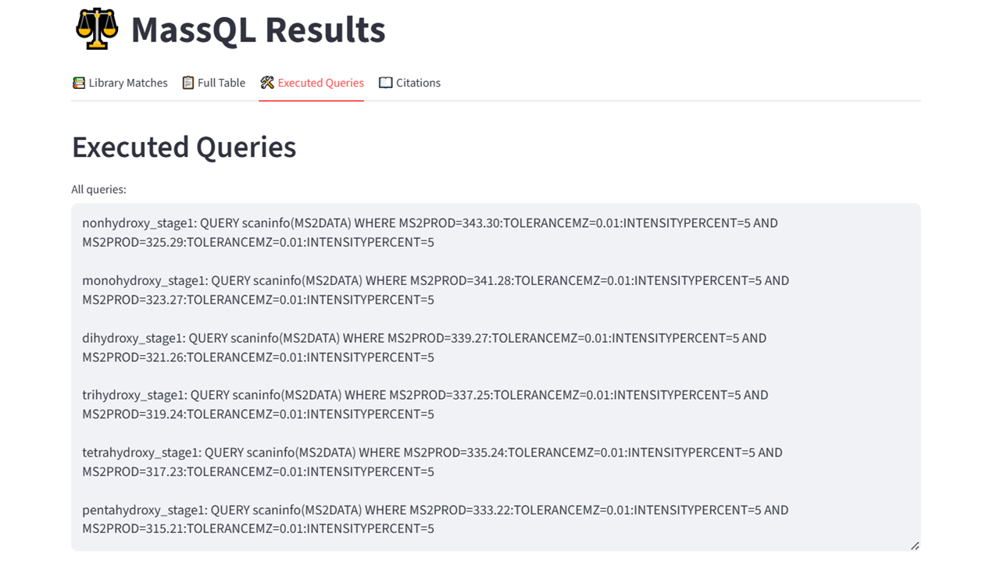

# PostMN MassQL

## Purpose

PostMN MassQL enables users to perform targeted spectral searches on clustered MS/MS data generated by GNPS2 molecular networking workflows. When a user runs a **Classical Molecular Networking (CMN)** or **Feature-Based Molecular Networking (FBMN)** job, one of the resulting outputs is a **consensus MGF file**, in which MS/MS spectra have been clustered using the **MSCluster** algorithm based on spectral similarity.

This app performs a MassQL-based query directly on the **clustered consensus MGF**, allowing users to search for specific fragmentation patterns (e.g., product ions, neutral losses, precursor *m/z*) within spectra that represent consensus across multiple features. Because the MGF has already been processed via clustering, this approach provides a computationally efficient way to explore chemically meaningful patterns and detect class-specific signatures without reprocessing raw MS/MS data.

## When to Use

Use this app when you want to:

* Search for known MS/MS fragments, neutral losses, or diagnostic ions;  
* Explore chemical classes of interest (e.g., bile acids, n-acyl lipids) based on characteristics fragmentation behavior;  
* Validate or generate hypotheses about compound classes on query hits.

## Accessing the App

* URL: [https://massqlpostmn.gnps2.org/](https://massqlpostmn.gnps2.org/) 

## Input Requirements

* A GNPS2 Task ID from a completed and public CMN or FBMN job.  
* A MassQL query, either selected from the prebuilt templates or written manually.

## Step-by-Step Instructions

### Step 1 – Open the Application

Open the app in your browser using the direct URL: [https://massqlpostmn.gnps2.org/](https://massqlpostmn.gnps2.org/)

The landing page will display the interface for submitting a GNPS2 job and MassQL query.

**Figure 1:** Landing page of the PostMN MassQL application. The interface includes fields for inputting the GNPS2 Task ID and MassQL query.

### Step 2 – Enter the GNPS2 Task ID

Paste your Task ID into the field labeled “**Enter GNPS2 Task ID**”. This will fetch the clustered MGF associated with your molecular networking job. Make sure the job is public; otherwise, the app will not be able to access the data.

**Figure 2:** Input field for entering a GNPS2 Task ID. This task must correspond to a completed CMN or FBMN job, and be publicly accessible.

### Step 3 – Select or Write a MassQL Query

In the section labeled “**Select one or more queries or groups**”, you can either:

* Select a predefined query from the dropdown list;  
* Write your own custom query following the MassQL syntax, or  
* Select and edit a predefined query from the list.

**Figure 3:** Interface of the PostMN MassQL app with a GNPS2 Task ID entered (top), the predefined query group “Bile acids (stage 1)” selected (1), and the Query Editor displaying the full list of MassQL queries for mono- to pentahydroxylated bile acid fragments (2). The “Run Analysis” button (3) executes the selected queries.

### Step 4 – Run the Query

Click the “**Run Analysis**” button. The app will search the clustered MGF for all spectra matching your query. This may take a few seconds or minutes depending on dataset size.

### Step 5 – View the Results

Once the MassQL query has been executed, a green notification bar appears at the bottom of the screen displaying “Analysis Complete”, indicating that the results are ready for review. The app interface is then updated to include four output tabs:

#### Library Matches Tab

The Library Matches tab displays all spectra from the dataset that matched GNPS reference libraries and specifies whether they satisfied the selected MassQL query conditions. The results table on the left includes the scan number, query validation outcome, compound name, spectrum ID, and other relevant metadata. On the right, the Summary for Library Table panel reports the total number of matched scans (5035) and breaks them down by query, including cases where no query condition was met. The table can be downloaded in .tsv format, and the “Generate MGF with validated scans” button allows exporting only the spectra that passed at least one query (Figure 4).

**Figure 4:** Library Matches tab showing (left) the table of spectra matched to GNPS reference libraries with query validation results, and (right) the summary panel reporting the total and per-query distribution of matches, including the option to download validated spectra as a .mgf file.

#### Full Table Tab

The Full Table tab lists all spectra from the dataset, regardless of whether they matched GNPS reference libraries, and specifies whether they satisfied the selected MassQL query conditions. The results table on the **left** includes the scan number, query validation outcome, compound name, spectrum ID, library name, and other relevant metadata. On the **right**, the **Summary for Full Table** panel reports the total number of scans (30,372) and breaks them down by query, including cases where no query condition was met. The table can be downloaded in .tsv format, and the **Generate MGF with validated scans** button allows exporting only the spectra that passed at least one query (Figure 5).

**Figure 5:** Full Table tab in the PostMN MassQL app. This view lists all consensus spectra from the molecular networking job, regardless of whether they matched GNPS reference libraries. The table (left) includes the scan number, query validation status, compound name, among others. The summary panel (right) shows the total number of scans and the distribution of those that passed each MassQL query.

#### Executed Queries Tab

This tab provides a record of all MassQL queries executed during the analysis (Figure 6). It serves as a reproducibility aid, enabling users to document, share, and re-run the same queries in future analyses or on different datasets.

**Figure 6:** Executed Queries tab in the PostMN MassQL app. This view lists all MassQL queries that were run during the analysis, including the complete syntax for each predefined query.

#### Citations

MassQL and Compendium queries: Damiani, T., Jarmusch, A.K., Aron, A.T., Petras, D., et al. (2025). A universal language for finding mass spectrometry data patterns. Nature Methods, 22(6), 1247–1254. [https://doi.org/10.1038/s41592-025-02660-z](https://doi.org/10.1038/s41592-025-02660-z)

Bile acid queries: Mohanty, I., Mannochio-Russo, H., Schweer, J.V., et al. (2024). The underappreciated diversity of bile acid modifications. Cell, 187(7), 1801–1818.e20. [https://doi.org/10.1016/j.cell.2024.02.019](https://doi.org/10.1016/j.cell.2024.02.019)

N-acyl lipids queries: Mannochio-Russo, H., Charron-Lamoureux, V., van Faassen, M., et al. (2025). The microbiome diversifies N-acyl lipid pools – including short-chain fatty acid-derived compounds. Cell, 188(15), 4154–4169.e19. [https://doi.org/10.1016/j.cell.2025.05.015](https://doi.org/10.1016/j.cell.2025.05.015)