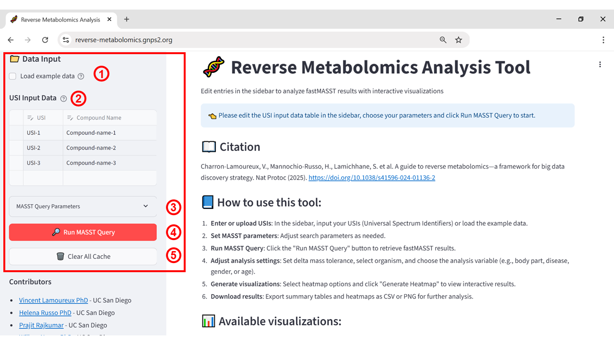
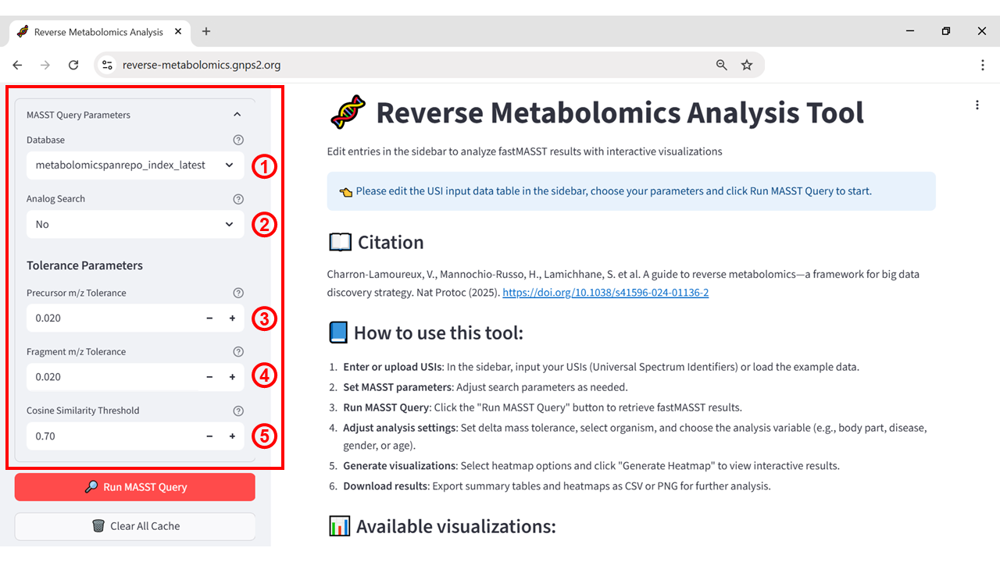
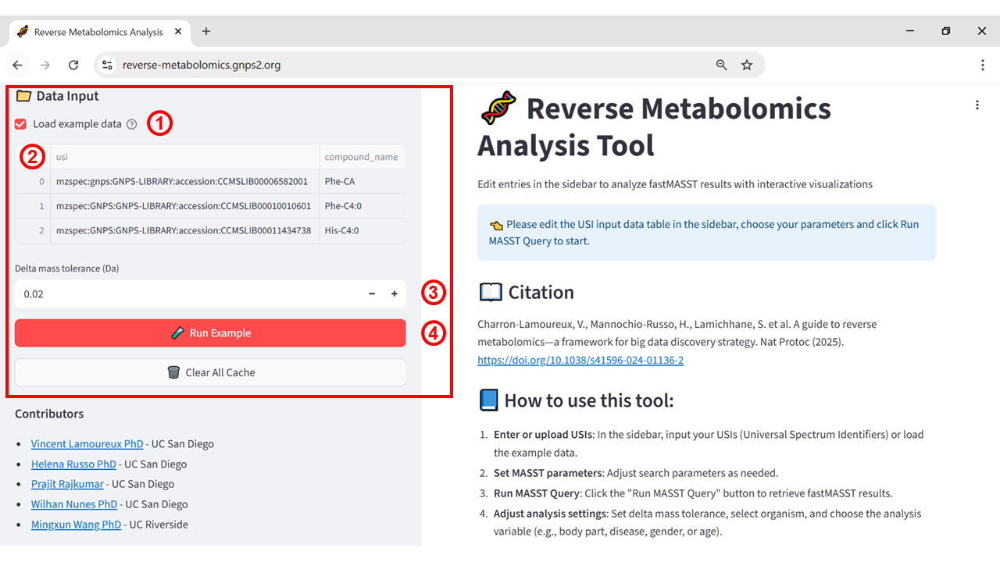
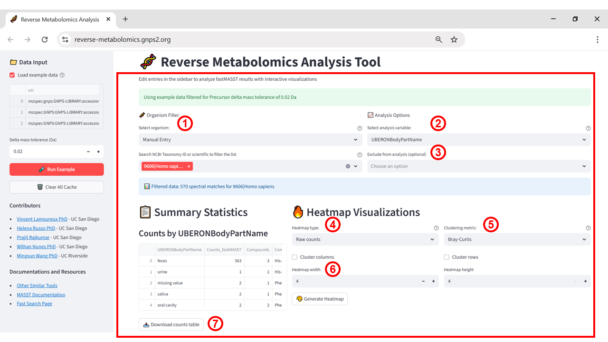
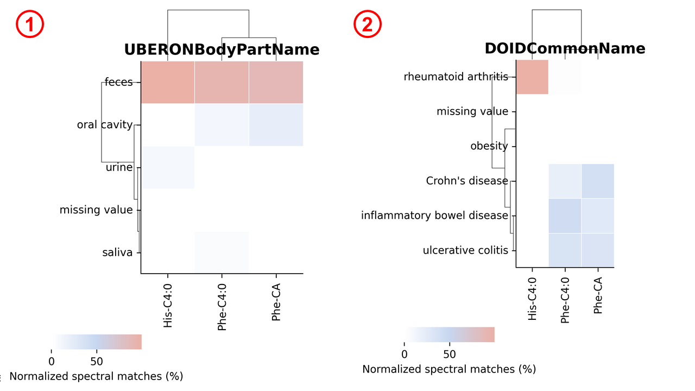
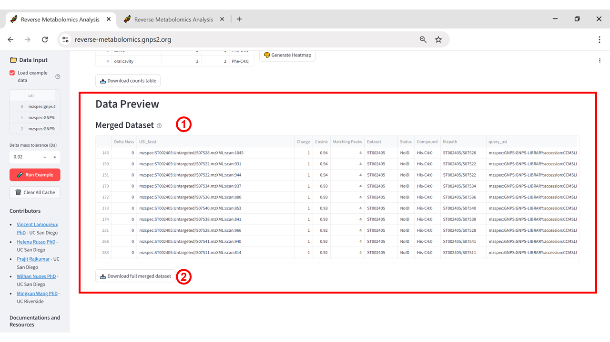

# Reverse Metabolomics

## Purpose

The **Reverse Metabolomics** application applies a discovery-driven strategy to systematically mine large-scale public LC-MS/MS metabolomics repositories. Starting from one or more MS/MS spectra of interest, it enables the identification of potential molecular producers, organ or biofluid distributions, and other biologically relevant associations by integrating spectral matches with curated dataset metadata. By leveraging millions of deposited LC–MS/MS runs and billions of spectra from repositories such as MetaboLights, Metabolomics Workbench, and GNPS/MassIVE, this approach transforms untargeted metabolomics into a big data framework for hypothesis generation and biological insight.

## When to Use

The Reverse Metabolomics application is most appropriate when starting from one or more annotated or unannotated MS/MS spectra to investigate their distribution and context across large-scale public metabolomics datasets. It is particularly useful for determining whether a molecule of interest is associated with specific organisms (including microorganisms, plants, or animals), tissues, biofluids, disease states, dietary influences, or other experimental conditions. This approach enables linking molecular features to potential biological functions, sources, or origins by leveraging repository-scale data and associated metadata.

## Accessing the App

The Reverse Metabolomics application can be accessed via the GNPS2 platform at [https://reverse-metabolomics.gnps2.org/](https://reverse-metabolomics.gnps2.org/). Upon opening, users are presented with an interface to input one or multiple Universal Spectrum Identifiers (USIs) representing the MS/MS spectra of interest. Example USIs are available, allowing users to explore the workflow without preparing their own inputs in advance.

## Input Requirements

The Reverse Metabolomics Analysis Tool requires Universal Spectrum Identifiers (USIs) as its primary input. A USI is a standardized identifier that uniquely points to an individual MS/MS spectrum of a small molecule within a public repository. USIs are widely used in the GNPS/MassIVE ecosystem and can also be obtained from repositories such as the Proteomics Identifications Database, MassBank, MetaboLights, Metabolomics Workbench, or Zenodo, as well as from in-house datasets. USIs can also be obtained for jobs run within the GNPS2 ecosystem (such as molecular networking jobs). In this workflow, USIs serve as the key search terms for MASST queries, enabling the retrieval of datasets, files, and scan numbers that match the specified parameters.

## Output Overview

After running the MASST query, the Reverse Metabolomics Analysis Tool provides multiple outputs to facilitate interpretation and downstream analysis. Users can generate interactive heatmaps by selecting their preferred visualization type and clicking "Generate Heatmap". These heatmaps summarize the distribution of matching MS/MS spectra across sample groups defined by the associated metadata.

Results can be downloaded as CSV tables or PNG images for external analysis and reporting. Three visualization modes are available:

* Raw counts – Displays the absolute number of direct spectral matches per metadata category.  
* Log-transformed counts – Applies a log₂ transformation to highlight patterns in low-abundance matches.  
* ReDU-normalized counts – Adjusts spectral match counts according to the relative availability of samples in the ReDU database, enabling a fairer comparison between categories.

## Step-by-Step Instructions

### Step 1 – Open the application

Access the Reverse Metabolomics webpage by navigating to [https://reverse-metabolomics.gnps2.org/](https://reverse-metabolomics.gnps2.org/). The interface provides the following options:

1. Load example data – populates the USI input table with predefined examples.  
2. USI Input Data – a table where users can manually enter or paste USIs along with corresponding compound names.  
3. MASST Query Parameters – adjustable search settings for the MASST query.  
4. Run MASST Query – initiates the search across public LC–MS/MS datasets.  
5. Clear All Cache – removes stored data from previous searches.

**Figure 1\.** Initial interface of the *Reverse Metabolomics Analysis Tool*. (1) Option to load example data. (2) Field to input or upload USIs (*Universal Spectrum Identifiers*) and corresponding compound names. (3) MASST query parameter settings. (4) Button to execute the search (*Run MASST Query*). (5) Option to clear all cache.

Once the USIs are loaded, the MASST query parameters can be expanded and configured to refine the search (Figure 2). These settings include (1) database selection, (2) enabling or disabling analog search, (3) precursor mass tolerance, (4) fragment mass tolerance, and (5) minimum cosine score. 

**Figure 2:** MASST query parameter configuration, showing (1) selection of the reference database for spectral matching, (2) option to enable or disable analog search, (3) precursor m/z tolerance setting, (4) fragment m/z tolerance setting, and (5) cosine similarity threshold for match acceptance.

### Step 2 – Enter the USI and configure analysis parameters

In this step, Universal Spectrum Identifiers (USIs) are entered into the input table, each corresponding to a specific MS/MS spectrum of interest (Figure 3). For demonstration purposes, the built-in example dataset is used, which automatically populates the table with predefined USIs and associated compound names — *phenylalanine–cholic acid* (Phe–CA), *phenylalanine–butanoic acid* (Phe–C4:0), and *histidine–butanoic acid* (His–C4:0). The delta mass tolerance can then be set to define the allowed mass deviation for matching results, after which the analysis is initiated by clicking **Run Example**.

**Figure 3:** Data input interface of the Reverse Metabolomics App, showing (1) the option to load example data, (2) the USI and compound name table with the molecules Phe–CA, Phe–C4:0, and His–C4:0, (3) delta mass tolerance adjustment, and (4) the button to run the example query.

### Step 3 – View the Results

After clicking **Run Example** in the previous step, the interface updates to display the analysis configuration and visualization options (Figure 4). The **Organism Filter** (1) allows restricting results to Humans, Rodents, or All Organisms. The Analysis Options panel enables selecting a metadata variable (2) – for example, UBERONBodyPartName – and optionally excluding specific categories from the analysis (3). Heatmap settings include choosing the heatmap type (4) – raw counts, log-transformed counts, or ReDU-normalized counts – and selecting a clustering metric (5), with options such as *Bray-Curtis*, *Correlation*, *Cosine*, *Euclidean*, among others. Users can also adjust the heatmap dimensions before generation. Clicking Generate Heatmap (6) produces an interactive visualization, while Download counts table (7) exports the summary statistics, including raw match counts for each metadata category, matched compound names, and the number of unique compounds detected.

**Figure 4:** Post-query configuration options: (1) organism filter (Humans, Rodents, All Organisms), (2) analysis variable, (3) optional exclusion, (4) heatmap type (raw, log-transformed, ReDU-normalized), (5) clustering metric (e.g., *Bray-Curtis, Correlation, Cosine, Euclidean*), (6) heatmap generation, and (7) table download.

After configuring the heatmap parameters, the results can be visualized to reveal patterns of spectral matches across the selected analysis variables. For example, using the provided dataset, Figure 5 shows heatmaps generated for (1) **UBERONBodyPartName**, highlighting the distribution of the compounds *His-C4:0*, *Phe-C4:0*, and *Phe-CA* across different body parts, and (2) **DOIDCommonName**, illustrating their occurrence across various disease states. These visualizations facilitate the identification of biological or clinical contexts where specific compounds are more prevalent.

**Figure 5:** Example heatmaps generated from the example dataset: (1) normalized spectral matches by body part (UBERONBodyPartName) and (2) normalized spectral matches by disease (DOIDCommonName).

At the end of the workflow, users can preview the merged dataset containing all matched spectra and their associated metadata (Figure 6). This table includes information such as delta mass, USI, charge, cosine score, number of matching peaks, dataset ID, compound name, and file path, allowing for detailed inspection of the search results. The complete table can be downloaded for further offline analysis and integration into other workflows.

**Figure 6:** Data preview and export options. (1) Preview of the merged dataset with spectral match details and metadata. (2) Button to download the full merged dataset as a CSV file.

## Citations

Charron-Lamoureux, V., Mannochio-Russo, H., Lamichhane, S. *et al.* A guide to reverse metabolomics—a framework for big data discovery strategy. *Nature Protocols* (2025). [https://doi.org/10.1038/s41596-024-01136-2](https://doi.org/10.1038/s41596-024-01136-2)

Wang, M., Jarmusch, A.K., Vargas, F. et al. Mass spectrometry searches using MASST. *Nature Biotechnology* (2020). [https://doi.org/10.1038/s41587-019-0375-9](https://doi.org/10.1038/s41587-019-0375-9)