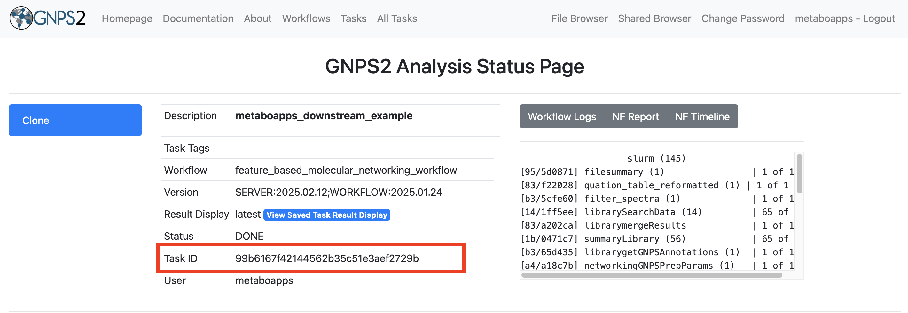
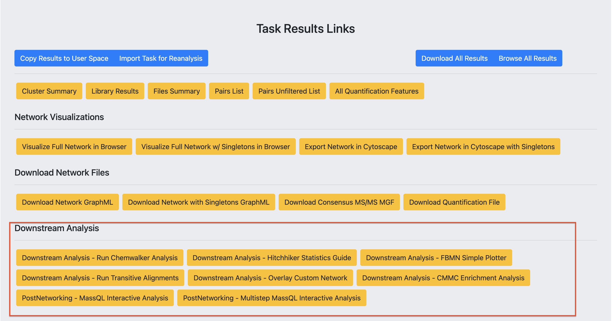

# MetaboApps

## Overview

MetaboApps are a collection of modular web applications designed to simplify and extend downstream analysis of mass spectrometry data within the GNPS2 ecosystem. Built using the Streamlit framework, these apps provide intuitive interfaces for performing analysis such as pattern-based filtering, ontology and enrichment analysis, statistical exploration, multi-omics integration, and repository-scale investigations – all without requiring coding experience. By leveraging GNPS2 job outputs (e.g., from Feature-Based Molecular Networking – FBMN), each app enables rapid and reproducible exploration of complex datasets. These tools are especially valuable for researchers aiming to move beyond molecular networking visualizations and extract deeper biological insights from untargeted metabolomics data.

## How to Launch a MetaboApp

MetaboApps can be accessed in two main ways:

1. Directly from a GNPS2 job via the “**Downstream Analysis**” section (see Supplementary Figure S1), or  
2. By visiting the app’s public URL.

Both methods are described below.

### From a GNPS2 Job

After submitting and completing a job on GNPS2 (e.g., FBMN), users can launch MetaboApps directly from the “**Downstream Analysis”** section of the job page. This automatically passes the **Task ID** and relevant output files to the selected app.

**Steps:**

1. Go to your GNPS2 Analysis Status Page.

**Supplementary Figure S1:** Interface of the GNPS2 Analysis Status Page. The Task ID associated with a completed job is highlighted with a blue rectangle. This identifier is required when launching MetaboApps manually via their respective URLs.

2. Scroll to the “**Task Results Links**” section and locate “**Downstream Analysis**”.

**Supplementary Figure S2:** Detail of the “Downstream Analysis” section, located under “Task Results Links” on a GNPS2 job page. This section displays the MetaboApps available for downstream analysis based on the selected workflow.

3. Click the button corresponding to the desired MetaboApp (e.g., “*PostMN MassQL*”, “*Multi-step MassQL*”).  
4. The selected app will open in a new browser tab, with your Task ID automatically pre-filled.

### Via Direct URL

Each MetaboApp can also be accessed directly through its public web URL, without navigating through the GNPS2 interface. This is useful for users who already know the app they want to use and have their GNPS2 Task ID ready.

Below is a list of currently available MetaboApps and their respective links:

* PostMN MassQL: [https://massqlpostmn.gnps2.org/](https://massqlpostmn.gnps2.org/)   
* Multi-step MassQL: [https://multistep-massql.gnps2.org/](https://multistep-massql.gnps2.org/)   

[//]: # (* Reference Data-Driven: [https://gnps-rdd.streamlit.app/]&#40;https://gnps-rdd.streamlit.app/&#41;   )
* Drug readout: [https://drugreadouts.gnps2.org/](https://drugreadouts.gnps2.org/)   
* Food readout: [https://foodreadouts.gnps2.org/](https://foodreadouts.gnps2.org/)   
* CMMC dashboard: [https://cmmc-dashboard.gnps2.org/](https://cmmc-dashboard.gnps2.org/)   
* FBMN Stats: [https://fbmn-statsguide.gnps2.org/](https://fbmn-statsguide.gnps2.org/)   
* Chemprop: [https://chemprop.gnps2.org/](https://chemprop.gnps2.org/)   
* CorrOmics: [https://corromics.gnps2.org/](https://corromics.gnps2.org/)   
* Conjugated Metabolome Explorer: [https://conjugated-metabolome.gnps2.org/](https://conjugated-metabolome.gnps2.org/)   
* Reverse Metabolomics: [https://reverse-metabolomics.gnps2.org/](https://reverse-metabolomics.gnps2.org/) 

For a detailed walkthrough on how to use each app – including required inputs, expected outputs, and example datasets go to the specific app documentation pages listed in the sidebar.

## Data Requirements & Recommendations

Each MetaboApp requires, at minimum, a valid GNPS2 **Task ID** from a completed job. Depending on the analytical goal of the app, additional input files such as metadata tables may be required. Below, we outline general requirements to ensure smooth operation across all MetaboApps.

### GNPS2 Task ID

The **Task ID** is a unique 32-character hexadecimal string assigned to every job submitted on GNPS2. It encodes all provenance information related to the analysis and serves as the primary input for most MetaboApps.

**Format:**

* Example*: 58e0e2959ec748049cb2c5f8bb8b87dc*

**Where to find it:**

* In the job URL:  [https://gnps2.org/status?task=*58e0e2959ec748049cb2c5f8bb8b87dc*](https://gnps2.org/status?task=58e0e2959ec748049cb2c5f8bb8b87dc) 

Within the job results interface (see *Supplementary Figure S1*)
