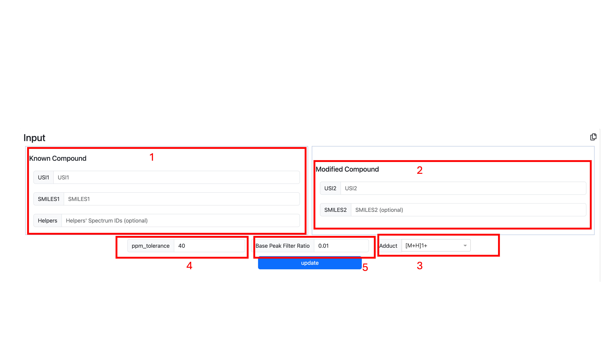
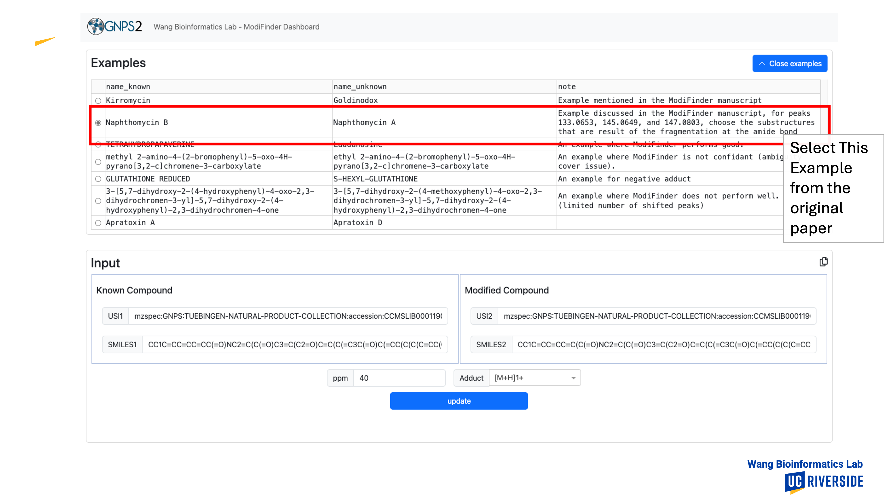
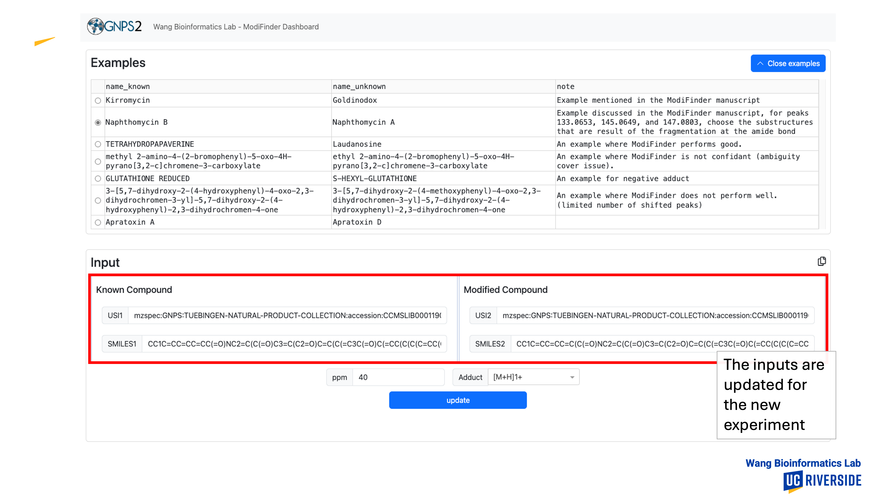
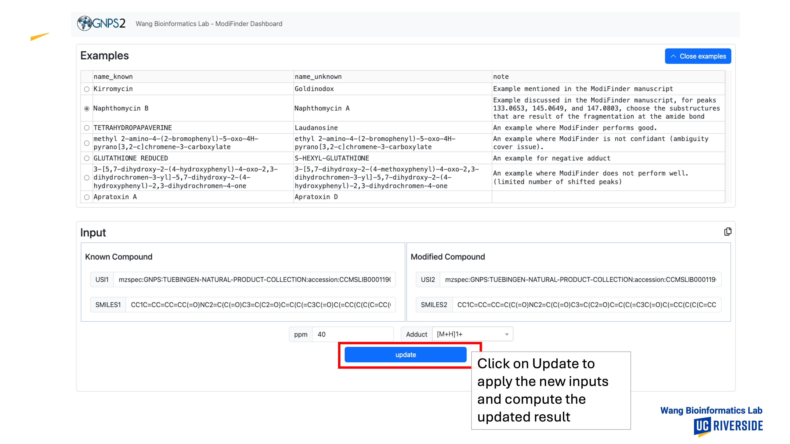
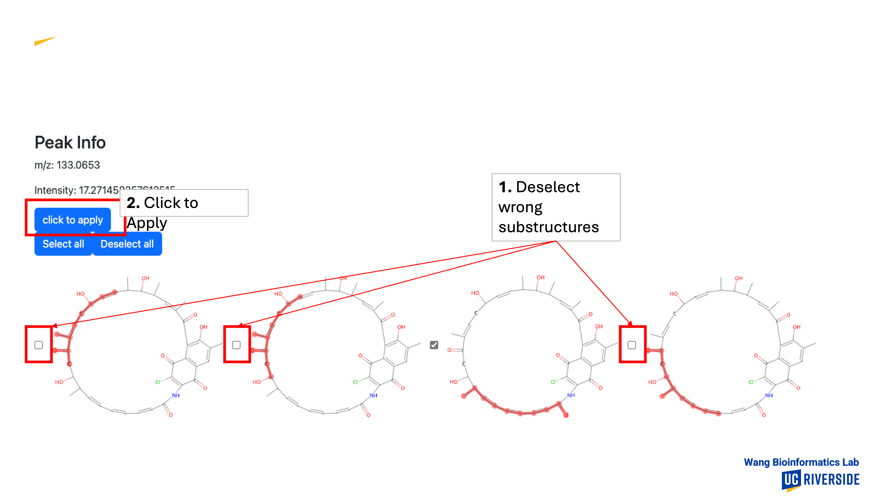
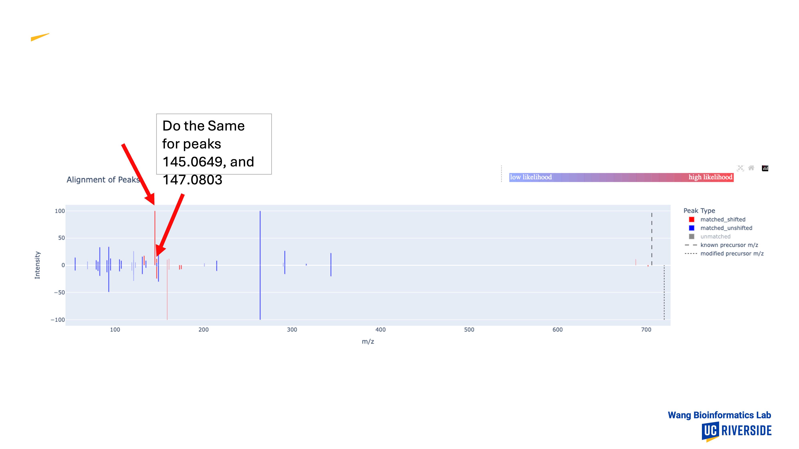

# GNPS2 Interactive Web Interface

Head to [ModiFinder Interactive Web Interface](https://modifinder.gnps2.org/), and use the information for your target compound and its known analog to generate the result.

## Providing the Input

1. Pass the information for the known analog to the known compound section of the input, the inputs are:

    * USI for the known Compound
    * Smiles for the known Commpound
    * Helper ID's if available

2. Pass the Information for the unknown Compound

    * USI for the unknown target compound
    * Smiles of the unknown (optional, just for evaluation)

3. Set the Adduct
4. set the ppm tolerance
5. set the base peak filter ratio

**Universal Spectrum Identifiers (USI):** The Universal Spectrum Identifiers(USI) for both known and unknown compounds should be provided as they encompass the peak information used in the alignment step.

**SMILES:** ModiFinder is designed to accept molecular structures in SMILES notation. Providing the SMILES for the unknown compound is optional and is used to generate additional results that are particularly useful for evaluating and visualizing ModiFinder's performance with compounds whose structures are already known.

**ppm:** This input determines the error tolerance of ModiFinder in ppm. This error tolerance is used both in the alignment step and when annotating the peaks with substructures.

**base peak filter ratio:** Any peak less than the provided ratio of the base peak will be removed as a cleaning mechanism to reduce the effect of noise.

**Adduct:** This input determines the Adduct used.

** _Note: There are examples provided in the examples tab, you can select any example and click on the update button to see the result._

## Visualization Output

**Stats Table:** This table contains general information about the pair, detailing aspects like the mass difference and the count of both total and shifted peaks observed in the alignment. In the case that SMILES2 is provided, an evaluation score is also provided. This evaluation score evaluates the ModiFinder performance against ground truth.

**Prediction:** This image shows a heatmap representation of the structure, where atoms with a higher likelihood of being the modification site are highlighted in shades of red, while those less likely to be modified appear in cooler blue tones.

**Modification Highlight:** If SMILES2 is provided, an image indicating the true modification and the modification site is displayed.

**Peaks:** This visualization displays the alignment of peaks, with the peaks of the known compound positioned at the top and those of the modified compound at the bottom. Peaks that are both matched and shifted are indicated in red, while matched but unshifted peaks are highlighted in blue. Peaks that do not have a match are represented in gray. Clicking on a matched and shifted peak will highlight that peak and its corresponding match.

## Refinement of MS/MS substructure annotation

By selecting a peak associated with the known compound, all the potential substructures assigned to that peak by ModiFinder will be shown. Users have the ability to manually filter these substructures, incorporating specialist domain knowledge into the filtering process.

## ModiFinder on Private Data
You need to first generate a USI for your data:
* Use https://tinymass.gnps2.org/ to upload your known compound spectrum and get a USI
(This does not add your data to the public libraries)
* Do the same thing for your unknown compound’s spectrum
* use the ModiFinder as described before

## Example on how to use ModiFinder
<!-- add images -->

