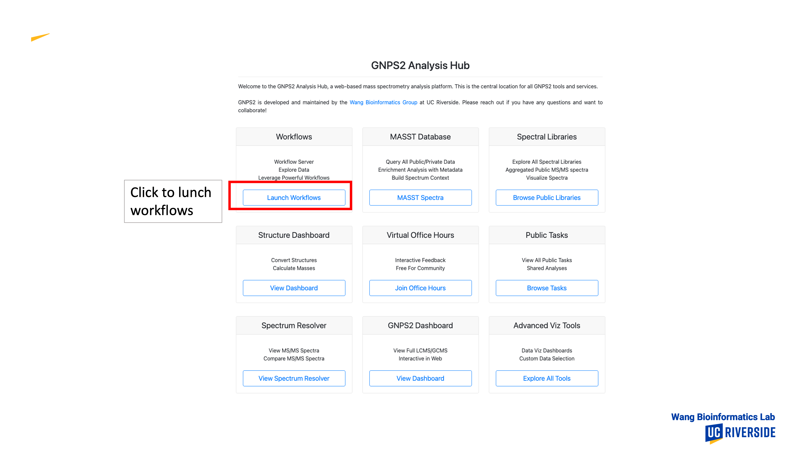
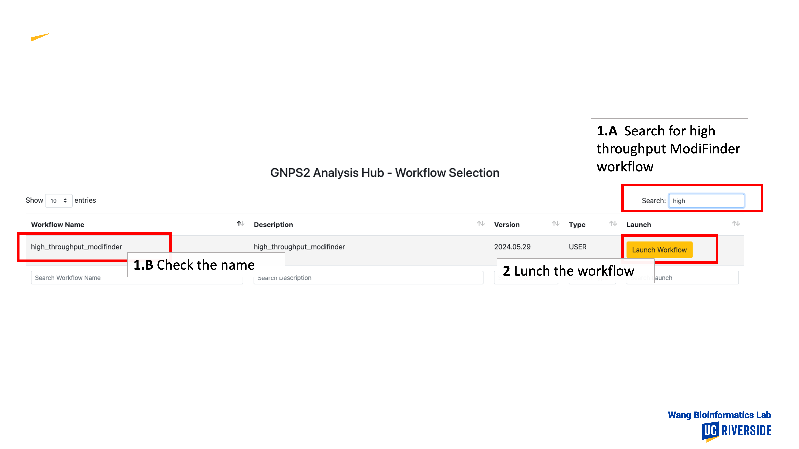
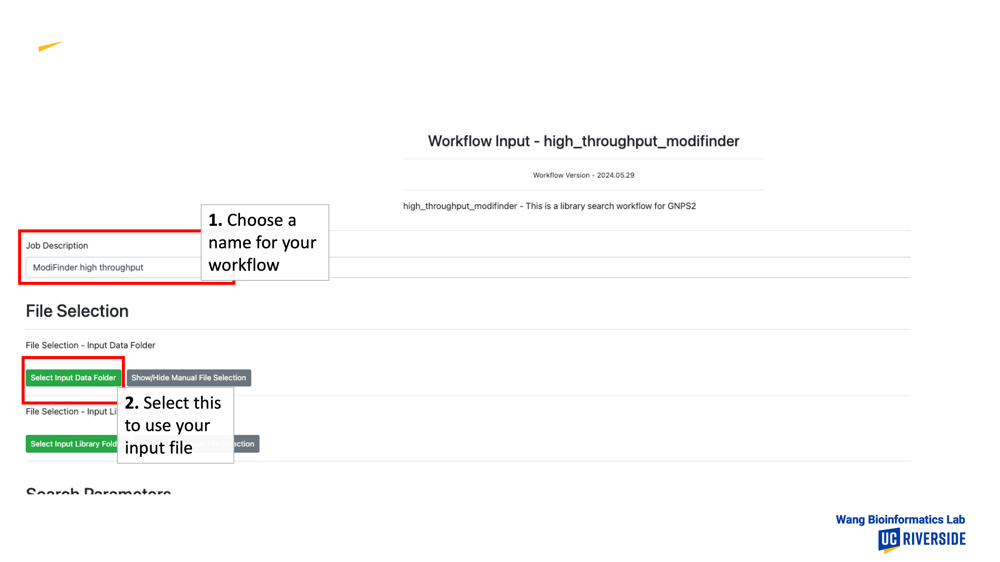
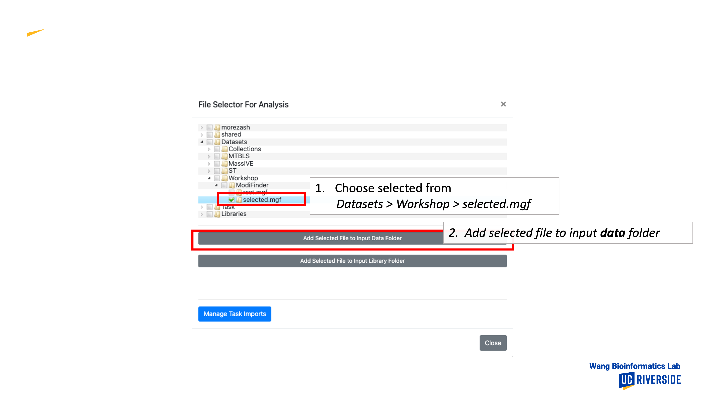
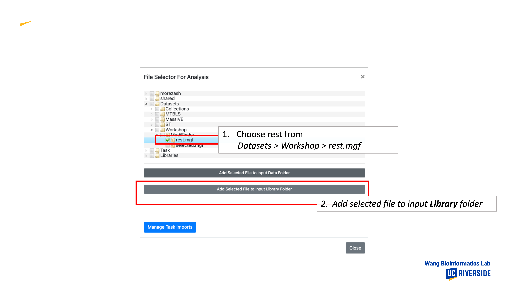
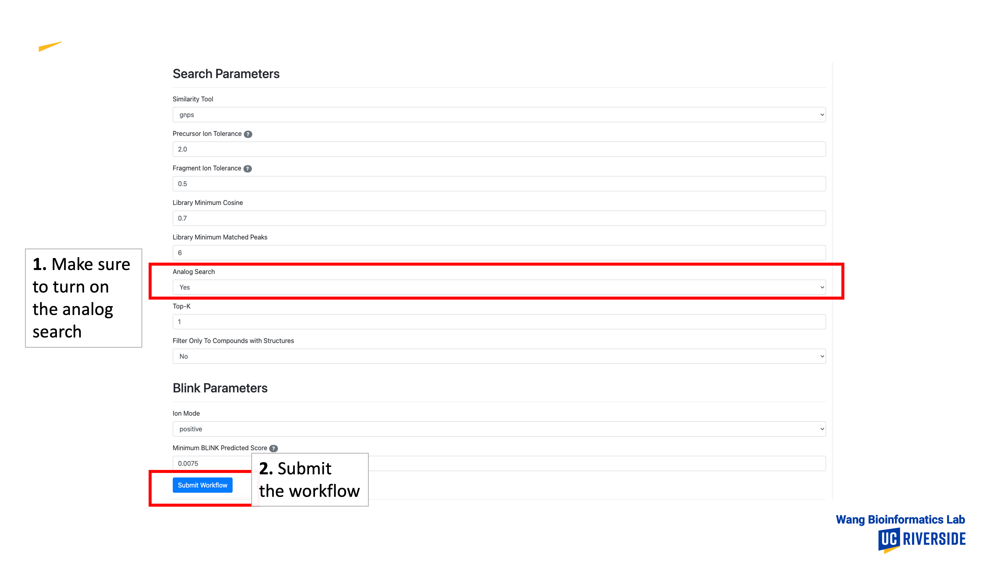
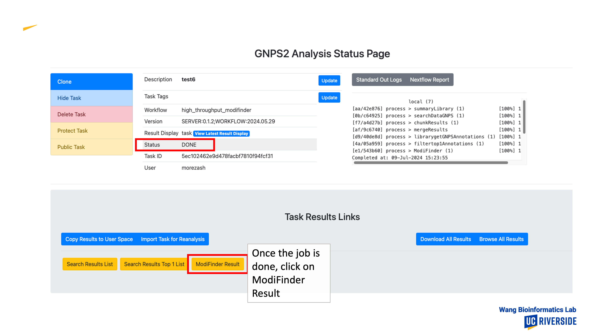
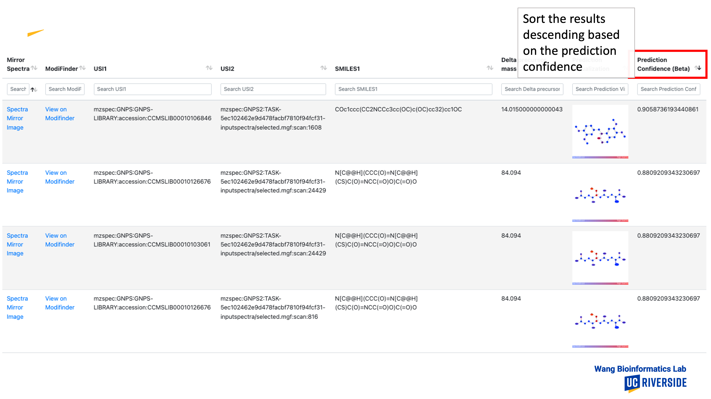
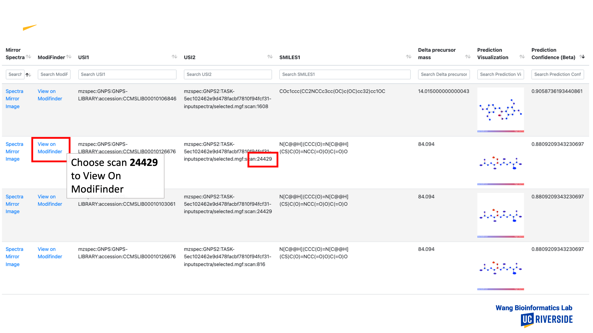
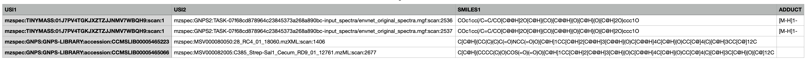

# High-Throughput Workflow

The code for the nextflow workflow is available on [GitHub](https://github.com/Wang-Bioinformatics-Lab/highThroughputModiFinder_workflow). if you need to customize it or run on private data. It is also available as a workflow on GNPS with linkouts to the web interface and other GNPS tools. This can be accessed [here](https://gnps2.org/workflowinput?workflowname=high_throughput_modifinder). There are two distinct ways to use this workflow

1. Analog Library Search + ModiFinder
2. Pre-determined analogs with a csv input (Matched Mode)

## Analog Library Search with ModiFinder

This mode begins with an Analog Library Search, which uses the same input format as the Library Search workflow. The search identifies potential matches. The matched results are then processed by ModiFinder, which predicts the location of modifications for each compound pair.

### Example

1. Log In to GNPS and Lunch a workflow

1.  Lunch ModiFinder Workflow

1. Set the name for your library and select your input file for the library search

1. For This example, you can use one of our predefined examples at `Datasets > Workshop > selected.mgf`

1. Choose the library to search against, for this example you can use the predefined file at `Datasets > Workshop > rest.mgf`

1. Make sure to enable the analog library search (if the option is available) and submid the workflow. You can also customize other variables.

1. Once the status of your task is done, check the modifinder result

1. You can sort the result base on the prediction confidance

1. You can use the provided prediction image, or view the result on ModiFinder web

## Matched Mode

The input for this mode should be a CSV file containing the following columns:

- **USI1**: The USI (Unique Structure Identifier) of the known compound.
- **USI2**: The USI of the unknown compound.
- **SMILES1**: The structural information of the known compound, represented in SMILES format.
- **ADDUCT (Optional)**: The adduct information for the known scan is determined as follows: If the scan corresponds to a library spectrum, the adduct details are retrieved from the library. If the scan is not a library spectrum and an adduct column is present, the data from that column is used. If the column is absent, `[M+H]1+` is used as the default adduct. supported_adducts are: [`[M+H]1+`, `[M-H]1-`, `[M+Na]1+`, `[M+NH4]1+`, `[M+K]1+`, `[M+Cl]1-`, `[M+Br]1-`].

By default, these column names are "USI1", "USI2", and "SMILES1". However, you can customize these settings on the Workflow Launcher page. For each pair (row) in the CSV file, ModiFinder will predict the modification site from the known compound to its analog.

Here is an example for the input CSV file:

