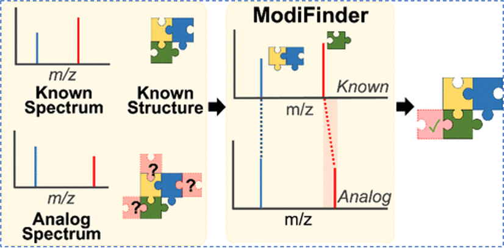
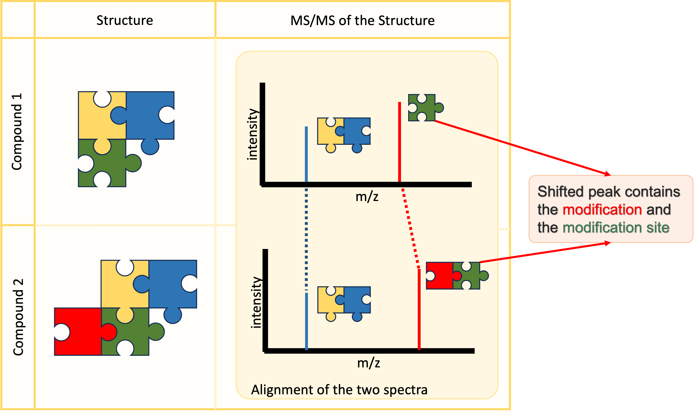
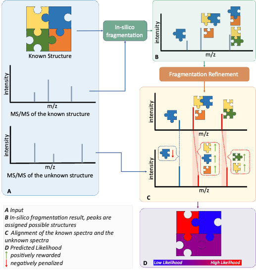

# ModiFinder

ModiFinder is a tool for site localization of structural modifications using MS/MS data. There are several ways to use ModiFinder:

## How to Use

1. [GNPS Interactive Web Interface](https://modifinder.gnps2.org/)
1. [High-throughput Nextflow Workflow](https://github.com/Wang-Bioinformatics-Lab/highThroughputModiFinder_workflow)
1. [GNPS2 High-Throughput Workflow](https://gnps2.org/workflowinput?workflowname=high_throughput_modifinder)
1. [Python Package Documentation](https://wang-bioinformatics-lab.github.io/ModiFinder_base/)


## Citation
[
    **ModiFinder: Tandem Mass Spectral Alignment Enables Structural Modification Site Localization**](https://pubs.acs.org/doi/10.1021/jasms.4c00061)

[<em>Mohammad Reza Zare Shahneh, Michael Strobel, Giovanni Andrea Vitale, Christian Geibel, Yasin El Abiead, Neha Garg, Berenike Wagner, Karl Forchhammer, Allegra Aron, Vanessa V Phelan, Daniel Petras, and Mingxun Wang
Journal of the American Society for Mass Spectrometry<em>](https://pubs.acs.org/doi/10.1021/jasms.4c00061)

[DOI: <em>10.1021/jasms.4c00061<em>, PMID: <em>38830143<em>](https://pubs.acs.org/doi/10.1021/jasms.4c00061)

```
@article{doi:10.1021/jasms.4c00061,
author = {Shahneh, Mohammad Reza Zare and Strobel, Michael and Vitale, Giovanni Andrea and Geibel, Christian and Abiead, Yasin El and Garg, Neha and Wagner, Berenike and Forchhammer, Karl and Aron, Allegra and Phelan, Vanessa V and Petras, Daniel and Wang, Mingxun},
title = {ModiFinder: Tandem Mass Spectral Alignment Enables Structural Modification Site Localization},
journal = {Journal of the American Society for Mass Spectrometry},
volume = {0},
number = {0},
pages = {null},
year = {0},
doi = {10.1021/jasms.4c00061},
    note ={PMID: 38830143},
}
```


## ModiFinder Theory
ModiFinder is developed to focus on finding the modification site between an unknown compound and its known analog.



ModiFinder leverages the principle that minor structural changes in a molecule cause predictable shifts in fragment peaks. If a fragment from an unmodified molecule incorporates a modification, the mass difference between corresponding peaks reflects the modification's mass. 



By combining combinatorial fragmentation with peak alignment, ModiFinder effectively scores and localizes these modifications, providing an automated solution for structural analysis.

