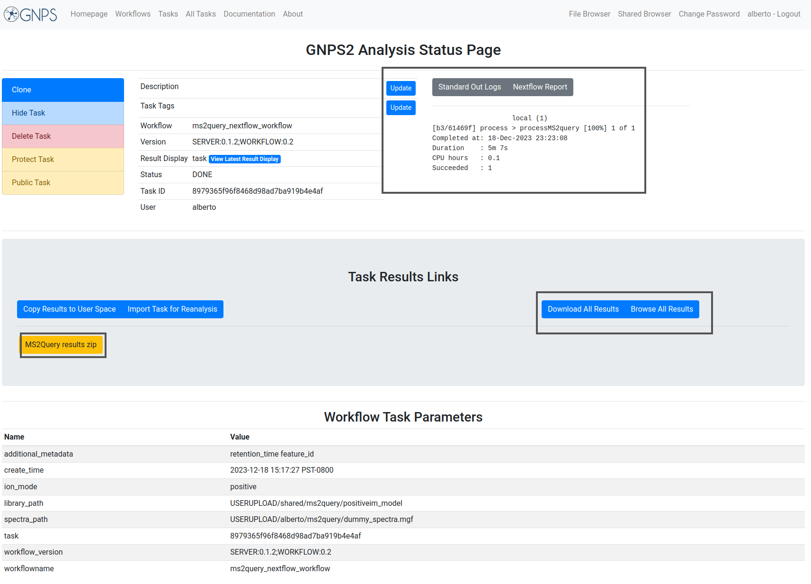
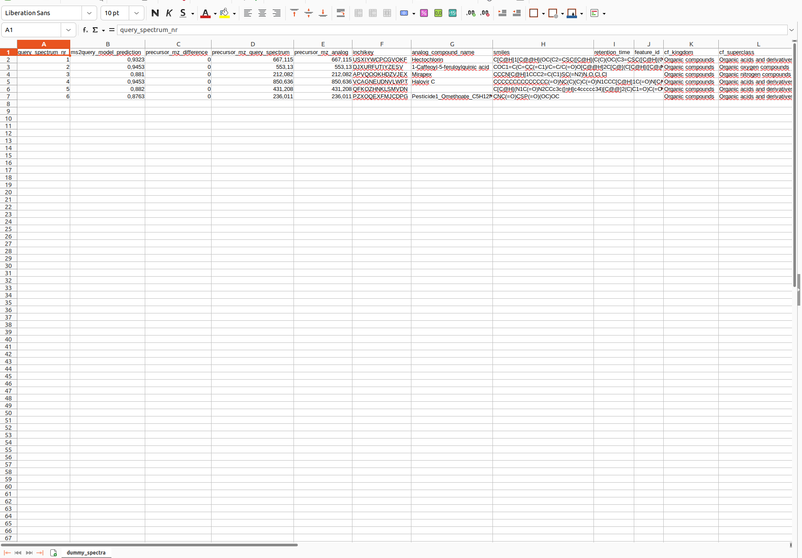

# MS2Query workflow documentation

MS2Query is a tool published by N. De Jonge et al. for annotating MS2 spectra, by finding the best match in mass spectral libraries.
What makes MS2Query unique is that it will also return analogues if no good exact match is available. An analgoue is a metabolite that is chemically very similar to your metabolite, but can have some modifications. Analogues can be a great starting point for annotation, or can help you to prioritize metabolites/spectra for further analysis. 
Including analogues increases the number of spectra for which you get some results by a lot, thereby making it possible to learn more from your data!

MS2Query gives more results and more reliable predictions compared to previous methods for library matching, like (modified) cosine score or MS2Deepscore. 
MS2Query uses previously developed machine learning algorithms (MS2Deepscore and Spec2Vec) to predict chemical similarity between your spectra and library spectra. 
MS2Query is able to improve the reliability of the predicitons a lot by not directly picking the highest predicted similarity, but looking at many predictions for similar library metabolites first, to make sure the potential match is not a false positive. 
More details about how this was implemented and the benchmarking results can be found in: https://www.nature.com/articles/s41467-023-37446-4 Please cite this article as well if you use MS2Query. 

The code of MS2Query is fully open source and can be found on https://github.com/iomega/ms2query 
Here you can also read how you can easily run MS2Query locally from the command line. 

## Quick tutorial of MS2Query workflow

### Input

| Parameter  | Description        |  Default | Required | 
| ------------- |-------------| -----| -----|
| Job Description | Label for the MS2Query job to identify it by the user. | | no |
| Spectra files | Provide a file with ms/ms spectra. Allowed formats are mzML, json, mgf, msp, mzxml or usi. Those files should have been uploaded to GNPS2 See [file upload documentation](fileupload.md). | | yes |
| Ionization mode | Mass spectrometry acquisition mode. | Positive | yes |
| Library models | MS2Query uses a Random Forest Model to rank the highest scores in similarity spectra. This The users can use their own models. If the user chooses negative ionization mode, change the model to shared/ms2query/negativeim_model. To train your own models, check the [github documentation](https://github.com/iomega/ms2query/tree/main). | positiveim_model | yes | 
| Additional metadata columns from the experimental data | The columns will be added to the output file with their corresponding values. The name should match the name on the spectra file. It is case sensitive. | retention_time feature_id | no |

The fields are presented in the image. Bold fields are mandatory:

### Example Input

| #   | Information                                        | Value                                      |
| --- | ------------------------------------------------- | ------------------------------------------- |
| 1.  | Task description                                  | User label to identify the workflow task    |
| 2.  | **Spectra Files**                               | USERUPLOAD/alberto/ms2query/dummy_spectra.mgf |
| 3.  | **Ionization mode**                               | Positive                                    |
| 4.  | **Library models**                                | USERUPLOAD/shared/ms2query/positiveim_model |
| 5.  | **Additional metadata columns**                   | retention_time feature_id                   |

### Output

| #   | Item                              | Description                                                                                                                      |
| --- | ----------------------------------| ---------------------------------------------------------------------------------------------------------------------------------|
| 1.  | **Log Text area**                 | Text area with the result of the task. If there is some failure, the log will be written there. If the task failed and you want to contact the support team, please provide the output of this text area along with the job id. |
| 2.  | **Full results from the job**     | Full results from the job. It can provide information to debug or to users with programming knowledge.                          |
| 3.  | **MS2Query results.zip**    | Zip file containing the csv file with the annotations. |

The different parts of the output are presented in the image:

## Example task

To test the functionality of the MS2Query workflow an [Example task](https://gnps2.org/status?task=8979365f96f8468d98ad7ba919b4e4af) can be visited, and this work can be reproduced by clicking the [clone button](./img/workflows/clone_button.png): 

### Example output

The result of the task is the annotation of features present in the MS/MS spectra file. MS2Query assigns a identifier for each spectra annotated, their corresnponding ms2query_model_prediction_score, the delta m/z of the precursor mass, the representation of the structure (InChI Key and SMILES, the metadata columns added by the user and the corresponding class )

 

# Interpretation results

As output a csv file is returned. For each of your input spectra MS2Query predicts a library match. It is important to check the ms2query_model_prediction column. This column contains a score, which indicates the likelihood that the found match is a good match. This score ranges between 0 and 1, the closer this score is to 1 the more likely that it is a good match/analogue. It is important to use this score to select only the reliable hits, since a prediction is given for each spectrum, regardless of the ms2query score. There is no strict minimum for this score, but the higher the MS2Query model prediction the more likely it is a good match/analogue. It will depend on your research goal, what a good threshold is. If a high recall is important you might want a low threshold and if a high reliability is more important you might want a high threshold. To give a general indication, a score > 0,7 has many good analogues and exact matches. In the range of 0.6-0.7, the results can still be useful, but should be analysed with more caution and results below 0.6 can often best be discarded. 

MS2Query does not need two different workflows for searching for analogues and searching for exact matches, it automatically selects the most likely library spectra. If it is important to separate potential exact matches from potential analogues for your research question, the column with the precursor mz difference can be used to separate these results, since exact matches should have no precursor mz difference.
The columns completely to the right are estimated molecular classes based on the molecular structure of the predicted library molecule, these columns can be used to get a quick overview of the kind of compounds that were found. 

## Citation

[Niek F. de Jonge, Joris J. R. Louwen, Elena Chekmeneva, Stephane Camuzeaux, Femke J. Vermeir, Robert S. Jansen, Florian Huber, Justin J. J. van der Hooft. MS2Query: reliable and scalable MS2 mass spectra-based analogue search. Nature Communications 2023, 14: 1752](https://doi.org/10.1038/s41467-023-37446-4)

## Page Contributors

{{ git_page_authors }}

